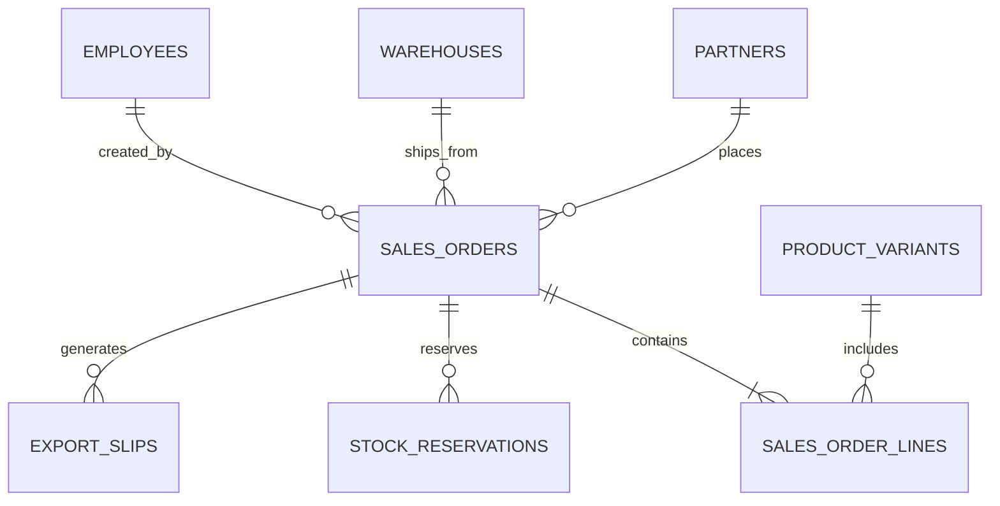

# Database & Data Model: Sales Order

Cấu trúc lưu trữ của hệ thống SO được thiết kế tối ưu cho RDBMS (MySQL) thông qua các Migration Scripts của Flyway.

## 1. ERD (Entity Relationship Diagram)

## 2. Table Definitions

### 2.1 Bảng `SALES_ORDERS`
Bảng chứa thông tin tổng thể của một hợp đồng / đơn bán hàng.

| Cột | Kiểu Dữ Liệu | Ràng buộc | Mô tả |
|---|---|---|---|
| `id` | BIGINT | PK, AUTO_INC | Khóa chính |
| `so_code` | VARCHAR(50) | UNIQUE, NOT NULL | Mã đơn hàng (VD: SO2608001) |
| `public_token`| VARCHAR(36) | UNIQUE, NOT NULL | Chuỗi UUID bảo mật dùng cho Báo giá Public |
| `partner_id` | BIGINT | FK | ID của Khách hàng |
| `warehouse_id`| BIGINT | FK | ID của Kho xuất hàng |
| `so_date` | DATE | NOT NULL | Ngày lập đơn |
| `payment_due_date`| DATE | NULL | Hạn chót thanh toán |
| `total_amount`| DECIMAL(19,4) | NOT NULL, DEFAULT 0 | Tổng giá trị đơn hàng |
| `paid_amount` | DECIMAL(19,4) | NOT NULL, DEFAULT 0 | Tổng tiền đã thu |
| `status` | VARCHAR(20) | NOT NULL | DRAFT, APPROVED, POSTED, CANCELLED |
| `payment_status`| VARCHAR(20)| NOT NULL | UNPAID, PARTIAL, PAID |
| `created_by` | BIGINT | FK | ID Nhân viên tạo đơn |
| `created_at` | DATETIME | | Thời điểm tạo |
| `updated_at` | DATETIME | | Thời điểm cập nhật cuối |

**Indexes:**
- `idx_so_code` (so_code)
- `idx_public_token` (public_token)
- `idx_partner_status` (partner_id, status)

### 2.2 Bảng `SALES_ORDER_LINES`
Bảng chứa các mặt hàng (biến thể) bên trong Đơn bán hàng.

| Cột | Kiểu Dữ Liệu | Ràng buộc | Mô tả |
|---|---|---|---|
| `id` | BIGINT | PK, AUTO_INC | Khóa chính |
| `sales_order_id`| BIGINT | FK | Thuộc về SO nào |
| `variant_id` | BIGINT | FK | Sản phẩm biến thể nào |
| `quantity` | DECIMAL(19,4) | NOT NULL | Số lượng mua |
| `unit_price` | DECIMAL(19,4) | NOT NULL | Giá bán 1 đơn vị |
| `line_amount` | DECIMAL(19,4) | NOT NULL | Thành tiền (quantity * unit_price) |

### 2.3 Bảng `STOCK_RESERVATIONS`
Quản lý số lượng hàng hóa bị giữ lại cho các Đơn hàng (hoặc Phiếu lắp ráp).

| Cột | Kiểu Dữ Liệu | Ràng buộc | Mô tả |
|---|---|---|---|
| `id` | BIGINT | PK, AUTO_INC | Khóa chính |
| `sales_order_id`| BIGINT | FK, NULL | Trỏ tới SO (Nếu giữ cho SO) |
| `variant_id` | BIGINT | FK | Sản phẩm bị giữ |
| `warehouse_id`| BIGINT | FK | Kho đang bị giữ hàng |
| `quantity_reserved`| DECIMAL(19,4)| NOT NULL | Số lượng giữ |
| `status` | VARCHAR(20) | NOT NULL | ACTIVE, RELEASED, FULFILLED |
| `expires_at` | DATETIME | NULL | Hạn chót giữ hàng (VD: 72h) |

## 3. Data Integrity & Triggers
- **Cascade Deletion:** Khi xóa 1 `SALES_ORDER` (chỉ khi DRAFT), hệ thống tự động xóa toàn bộ `SALES_ORDER_LINES` liên quan (cấu hình `cascade = CascadeType.ALL` trong Hibernate / JPA).
- **Migration V25:** Chèn `public_token` bằng lệnh `UPDATE SALES_ORDERS SET public_token = UUID() WHERE public_token IS NULL;` đảm bảo dữ liệu cũ không bị lỗi khi ra mắt tính năng bảo mật mới.
