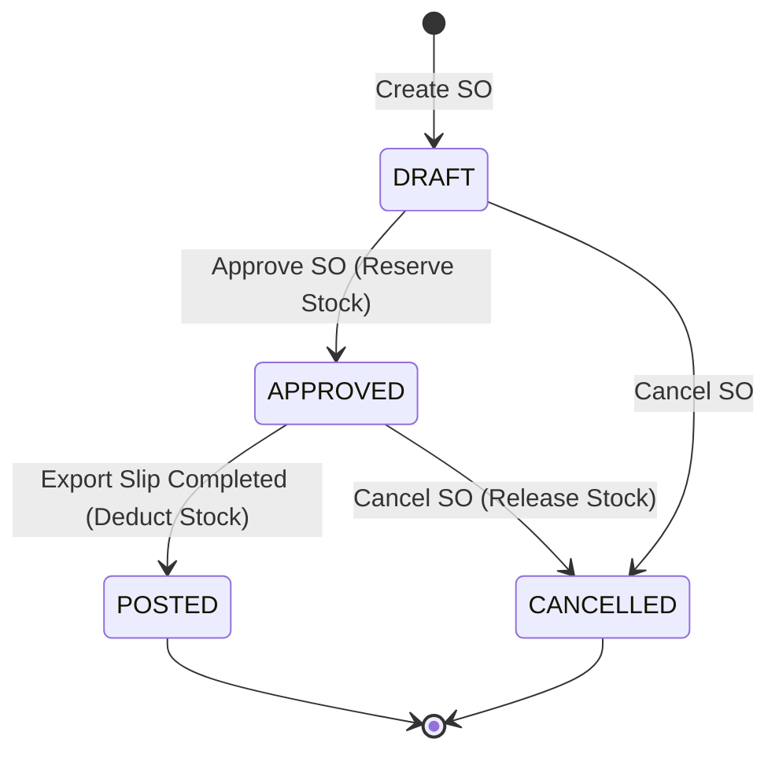

# Architecture & System Design: Sales Order

## 1. Kiến trúc luồng hệ thống (System Flow)

Kiến trúc của Sales Order được thiết kế theo mô hình **Event-Driven & Domain-Driven Design (DDD)** linh hoạt. 

### Sơ đồ State Machine (Trạng thái)

## 2. Thiết kế Cơ chế "Stock Reservation" (Giữ Tồn Kho)

Một trong những bài toán phức tạp nhất của WMS là tránh **Overselling** (bán lố).
Cơ chế được thiết kế như sau:

1. **Khái niệm Tồn kho:**
   - `total_quantity`: Số hàng vật lý nằm trong kho.
   - `reserved_quantity`: Số hàng đã bị "chốt" cho các đơn hàng nhưng chưa xuất đi.
   - `available_quantity`: `total - reserved`. Khả năng bán thực tế.

2. **Khi Duyệt SO (Approve):**
   - Vòng lặp kiểm tra từng line trong SO: `if (available_quantity < requested) throw Exception`.
   - Sinh ra Record trong bảng `STOCK_RESERVATIONS` (Status = ACTIVE).
   - Tăng `reserved_quantity` trong bảng `INVENTORY_BALANCES`.

3. **Khi Xuất Kho (Export Slip POSTED):**
   - Giảm `total_quantity` vật lý.
   - Chuyển `STOCK_RESERVATIONS` thành `FULFILLED`.
   - Giảm `reserved_quantity` trong bảng `INVENTORY_BALANCES`.
   - Lúc này `available_quantity` không đổi (vì total và reserved cùng giảm).

4. **Khi Hủy đơn (Cancel):**
   - Chuyển `STOCK_RESERVATIONS` thành `RELEASED`.
   - Giảm `reserved_quantity` trong `INVENTORY_BALANCES`.
   - `available_quantity` tự động tăng lên lại.

## 3. Thiết kế Security & Báo giá Public

Để phục vụ nhu cầu gửi Báo giá trực tuyến cho khách mà không cần tài khoản, hệ thống áp dụng mẫu **Security by Obscurity**:

- **Token Generation:** Tại `SalesOrderService.createSalesOrder()`, hệ thống dùng `java.util.UUID.randomUUID().toString()` để sinh 1 chuỗi 36 ký tự siêu ngẫu nhiên.
- **Routing:** Public route trên Controller được mở khóa qua `SecurityConfig`: `.requestMatchers("/api/v1/public/**").permitAll()`.
- **Throttling/Rate Limiting (Tương lai):** API public cần được bảo vệ trước các đợt DDoS, có thể áp dụng Bucket4j.

## 4. Giao diện (Frontend Design)
- **Component Based:** Tách biệt `CreateSalesOrderPage` (Form quản lý), `SalesOrderListPage` (Danh sách tìm kiếm) và `SalesOrderDetailPage` (Dashboard theo dõi đơn).
- **Date Formatting Validation:** Sử dụng thư viện `react-datepicker` để đồng bộ hóa input Datepicker với định dạng Tiếng Việt `dd/MM/yyyy`, vô hiệu hóa cơ chế parse Native Date lộn xộn của trình duyệt.
