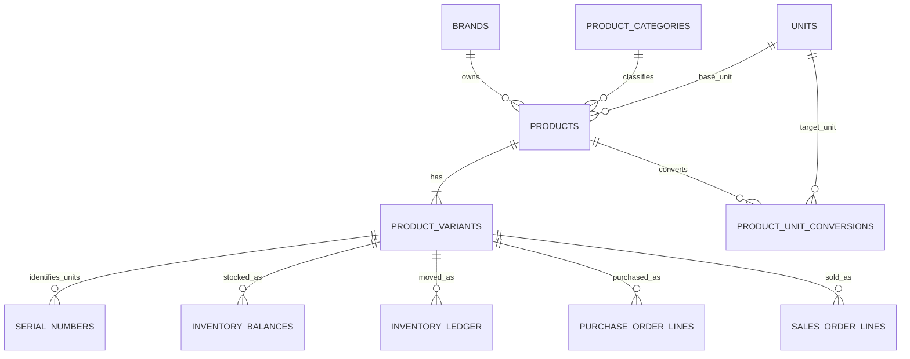
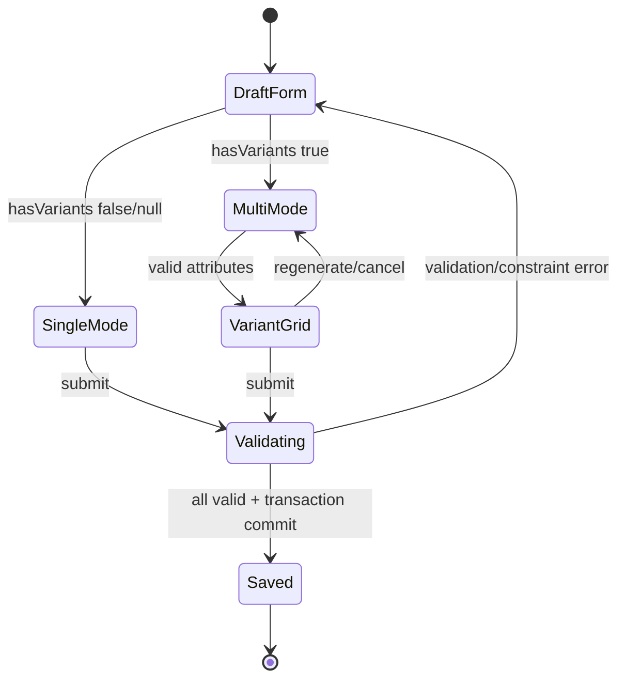

# Data Model: Fix Product Management

**Feature**: `[010-fix-product-management]`  
**Created**: 2026-09-04  
**Status**: Defined  
**Sources**: `spec.md`, `clarify.md`

## 1. Mục tiêu mô hình

Feature 010 không tạo mô hình dữ liệu mới. Mục tiêu là sử dụng đúng mô hình hiện có:

```text
Product 1 ── N ProductVariant 1 ── N SerialNumber
```

- Product chứa thông tin chung của dòng/model.
- ProductVariant là đơn vị SKU, giá, chính sách tồn và bảo hành.
- SerialNumber là từng đơn vị vật lý và không được tạo trong feature này.
- Mọi Product phải có ít nhất một ProductVariant.

## 2. Entity Relationship Diagram



Feature 010 chỉ ghi vào:

- `PRODUCTS`.
- `PRODUCT_VARIANTS`.
- `PRODUCT_UNIT_CONVERSIONS` nếu request có quy đổi đơn vị.

Feature 010 không ghi vào các bảng Serial, Lot, Inventory, Purchase, Sales, Warranty, Repair hoặc Assembly.

## 3. Aggregate boundary

Trong use case tạo Product, aggregate được xem là:

```text
Product Aggregate
├── Product
├── ProductUnitConversion[]
└── ProductVariant[]
```

Toàn bộ aggregate phải commit hoặc rollback cùng nhau.

Sau khi Product đã được tạo:

- ProductVariant có vòng đời riêng thông qua các endpoint Variant hiện có.
- Không được xóa Product/Variant nếu đã có operational references.
- SKU và tracking mode bị giới hạn thay đổi khi đã có giao dịch/tồn/serial.

## 4. PRODUCTS

### 4.1. Vai trò

Lưu thông tin dùng chung cho tất cả SKU thuộc cùng dòng/model sản phẩm.

### 4.2. Các field liên quan feature

| Field | Kiểu logic | Null | Quy tắc |
|---|---|---:|---|
| `id` | Long | Không | PK, auto increment |
| `productCode` | String(50) | Không sau khi save | Unique toàn hệ thống, backend có thể sinh trong single mode |
| `productName` | String(255) | Không | Tên dòng/model sản phẩm |
| `brand` | Brand reference | Theo rule hiện tại | Dùng chung cho mọi Variant |
| `category` | ProductCategory reference | Theo rule hiện tại | Dùng chung cho mọi Variant |
| `unit` | Unit reference | Không với hàng hóa | Base unit của mọi Variant |
| `productType` | String(50) | Không | Canonical: `Hàng hóa`, `Thành phẩm`, `Dịch vụ` |
| `vatRate` | Decimal(5,2) | Có | Dùng chung cho mọi Variant |
| `isAssembly` | Boolean | Có | Nếu true, Variant phải serial-tracked |
| `description` | Text | Có | Mô tả chung |
| `active` | Boolean | Không | Mặc định true |
| `imageUrl` | String | Có | Hình đại diện chung |

### 4.3. Các field tương thích tạm thời

Các field sau vẫn tồn tại trong Product/entity/request để hỗ trợ single mode và client cũ nhưng không phải nguồn dữ liệu chính thức của multi-variant Product:

| Legacy field | Single mode | Multi mode |
|---|---|---|
| `salePrice` | Copy sang default Variant | Bỏ qua/ghi giá trị mặc định 0 |
| `trackSerial` | Chuyển thành `trackingMode` của default Variant | Bỏ qua |
| `trackLot` | Chuyển thành `trackingMode` của default Variant | Bỏ qua |
| `minStockQty` | Copy sang default Variant | Bỏ qua |
| `warrantyPeriodMonths` | Copy sang default Variant | Bỏ qua |
| `stockQty` | Không được dùng để tạo tồn | Không được dùng |
| `stockValue` | Không được dùng để tạo giá trị tồn | Không được dùng |

Không xóa các cột legacy trong feature 010 vì việc đó ảnh hưởng nhiều API/report ngoài phạm vi. Các response Product hiện tại có thể tiếp tục trả dữ liệu tổng hợp/đại diện để tương thích UI.

## 5. PRODUCT_VARIANTS

### 5.1. Vai trò

ProductVariant là đơn vị giao dịch và quản lý tồn kho. SKU là business key của entity này.

### 5.2. Field definitions

| Field | Kiểu logic | Null | Default | Ràng buộc |
|---|---|---:|---:|---|
| `id` | Long | Không | Auto | PK |
| `product` | Product reference | Không | - | FK tới Product vừa tạo |
| `sku` | String(50) | Không | - | Unique toàn hệ thống, normalized uppercase |
| `barcode` | String(100) | Có ở request | Backend sinh | Unique toàn hệ thống khi có giá trị |
| `variantName` | String(255) | Không | - | Default Variant dùng productName; explicit dùng phần cấu hình |
| `costPrice` | Decimal(15,4) | Không | 0 | >= 0, giá tham chiếu |
| `salePrice` | Decimal(15,4) | Không | 0 | >= 0 |
| `manufacturerPartNumber` | String(100) | Có | null | Không unique |
| `specsJson` | JSON object logical | Có với default | null | Explicit Variant phải là object không rỗng |
| `trackingMode` | String(20) | Không | `NONE` | Enum logic: `NONE`, `LOT`, `SERIAL`, `SERIAL_LOT` |
| `minStockQty` | Decimal(15,4) | Không | 0 | >= 0, theo base unit |
| `warrantyMonths` | Integer | Không về domain | 0 | 0-120 |
| `active` | Boolean | Không | true | Ít nhất một Variant active trên Product mới |
| `createdAt` | LocalDateTime | Hệ thống | Current time | Audit timestamp |
| `updatedAt` | LocalDateTime | Hệ thống | Current time | Audit timestamp |

### 5.3. TrackingMode

Tracking mode là string enum ở tầng application để tương thích schema hiện tại:

```text
NONE
LOT
SERIAL
SERIAL_LOT
```

Derived behavior:

```text
isSerialTracked = trackingMode in {SERIAL, SERIAL_LOT}
isLotTracked    = trackingMode in {LOT, SERIAL_LOT}
```

Không tạo boolean tracking mới trên ProductVariant.

### 5.4. Unique constraints

| Constraint | Scope | Normalization application |
|---|---|---|
| Product code | Toàn hệ thống | Trim + uppercase |
| SKU | Toàn hệ thống | Trim + uppercase |
| Barcode | Toàn hệ thống khi non-null | Trim + case-insensitive comparison |
| Canonical specs | Trong cùng Product/request | Normalize JSON object thành canonical key |

Database unique constraint là lớp cuối cho Product code, SKU và barcode. Canonical specs được validate tại application vì hiện không có cột hash/index riêng và feature không thêm schema.

## 6. PRODUCT_UNIT_CONVERSIONS

### 6.1. Vai trò

Quy đổi đơn vị thuộc Product và được dùng chung cho tất cả Variant.

| Field | Quy tắc |
|---|---|
| `product` | Liên kết Product vừa tạo |
| `unit` | Đơn vị chuyển đổi hợp lệ |
| `operator` | `MULTIPLY` hoặc `DIVIDE` |
| `ratio` | > 0 |
| `note` | Optional |

Lỗi một conversion làm rollback Product và toàn bộ Variants.

`minStockQty` của Variant luôn được hiểu theo base unit, không theo đơn vị chuyển đổi.

## 7. SERIAL_NUMBERS

SerialNumber chỉ được mô tả để làm rõ ranh giới, không thay đổi trong feature 010.

| Field liên quan | Ý nghĩa |
|---|---|
| `variantId` | Serial thuộc đúng một ProductVariant |
| `serialNumber` | Mã do nhà sản xuất/nguồn hàng cung cấp |
| `assetTag` | Mã nội bộ duy nhất nếu hệ thống sử dụng |
| `warehouseId` | Vị trí kho hiện tại theo implementation |
| `status` | Trạng thái vòng đời serial |

Tạo Variant với `trackingMode = SERIAL` không tự tạo bất kỳ row `SERIAL_NUMBERS` nào.

## 8. Request model

### 8.1. ProductRequest mở rộng

```text
ProductRequest
├── existing Product fields
├── hasVariants: Boolean?
├── variants: ProductVariantRequest[]?
└── unitConversions: ProductUnitConversionRequest[]?
```

Field mới:

| Field | Kiểu | Persist trực tiếp | Ý nghĩa |
|---|---|---:|---|
| `hasVariants` | Boolean | Không | Chọn single/default hoặc explicit variant mode |
| `variants` | List<ProductVariantRequest> | Map sang ProductVariant | Danh sách Variant cuối cùng cần tạo |

### 8.2. Conditional validation

```text
SINGLE mode:
  hasVariants in {null, false}
  variants is null or empty
  Product.salePrice required
  Product defaults map to default Variant

MULTI mode:
  hasVariants = true
  1 <= variants.size <= 100
  productCode required
  Product.salePrice optional/ignored
  every Variant independently valid
```

### 8.3. ProductVariantRequest

| Field | Single/default source | Multi source |
|---|---|---|
| `sku` | Product code | Variant row |
| `barcode` | Backend generated | User value hoặc backend generated |
| `variantName` | Product name | Attribute values, ví dụ `Đen / 16GB` |
| `costPrice` | 0 | Variant row/default common |
| `salePrice` | Product sale price | Variant row |
| `manufacturerPartNumber` | null | Variant row |
| `specsJson` | null hoặc `{}` | Snapshot tổ hợp |
| `trackingMode` | Suy ra Product legacy flags | Variant row/default common |
| `minStockQty` | Product min stock | Variant row/default common |
| `warrantyMonths` | Product warranty months | Variant row/default common |
| `active` | Product active | Variant row, default true |

## 9. Frontend transient model

Các cấu trúc sau không được gửi lên backend ngoài dữ liệu Variant cuối cùng.

### 9.1. AttributeDefinition

```text
AttributeDefinition
├── id: local stable id
├── name: string
└── values: string[]
```

Validation:

- Tối đa 3 AttributeDefinition.
- Tên không rỗng, <= 50 ký tự, không trùng normalized name.
- Mỗi attribute có 1-20 values.
- Value không rỗng, <= 50 ký tự và không trùng trong cùng attribute.

### 9.2. VariantDraft

```text
VariantDraft
├── localId
├── canonicalKey
├── displayValues
├── sku
├── skuManuallyEdited
├── barcode
├── variantName
├── costPrice
├── salePrice
├── manufacturerPartNumber
├── specsJson
├── trackingMode
├── minStockQty
├── warrantyMonths
├── active
└── isDirty
```

`localId`, `canonicalKey`, `displayValues`, `skuManuallyEdited` và `isDirty` không gửi trong payload.

### 9.3. VariantDefaults

```text
VariantDefaults
├── costPrice
├── salePrice
├── trackingMode
├── minStockQty
├── warrantyMonths
└── active
```

Defaults chỉ được dùng khi tạo dòng mới hoặc khi người dùng thực hiện Apply to all.

### 9.4. ExcludedCombinationKeys

```text
Set<String> excludedCombinationKeys
```

- Giữ các tổ hợp bị người dùng xóa khỏi bảng.
- Được áp dụng lại sau khi Cartesian product được tái tạo.
- Reset khi người dùng chọn `Khôi phục tất cả tổ hợp` hoặc xác nhận tắt multi mode.

## 10. Specs JSON và canonical key

### 10.1. JSON logical model

```json
{
  "Màu sắc": "Đen",
  "Dung lượng": "16GB"
}
```

Yêu cầu:

- Root phải là JSON object.
- Explicit Variant phải có ít nhất một key.
- Key và value trong feature này là string.
- Không chấp nhận duplicate normalized attribute names.
- Không chấp nhận null, array hoặc nested object làm value.

### 10.2. Normalization

```text
normalize(value):
  Unicode NFC
  -> trim
  -> collapse whitespace
  -> lowercase(Locale.ROOT)
```

Không bỏ dấu trong canonical specs comparison.

### 10.3. Canonical key

```text
canonicalKey(specs):
  normalize each key/value
  -> sort entries by normalized key
  -> join as key=value with '|'
```

Ví dụ hai JSON sau có cùng canonical key:

```json
{"Màu sắc":"Đen","Dung lượng":"16GB"}
```

```json
{"Dung lượng":"16GB","Màu sắc":"đen"}
```

Canonical key:

```text
dung lượng=16gb|màu sắc=đen
```

## 11. Response model

`ProductResponse` bổ sung:

```text
variants: ProductVariantResponse[]?
```

Population rules:

| Endpoint | `variants` |
|---|---|
| `POST /api/v1/products` | Bắt buộc populate toàn bộ vừa tạo |
| `GET /api/v1/products/{id}` | Populate toàn bộ |
| Product list/search | Có thể null/empty để tránh N+1 |

Không đưa SerialNumber vào response create Product.

## 12. State và lifecycle rules

### 12.1. Product create state



### 12.2. Variant mutation after create

| Dữ liệu vận hành đã tồn tại | Đổi SKU | Đổi tracking group | Sửa giá/MPN/warranty |
|---:|---:|---:|---:|
| Không | Cho phép | Cho phép | Cho phép |
| Có | Không | Không | Cho phép nếu rule khác hợp lệ |

Tracking group:

- Non-serial group: `NONE`, `LOT`.
- Serial group: `SERIAL`, `SERIAL_LOT`.

Đổi trong cùng group vẫn phải được đánh giá theo dữ liệu lot/serial thực tế; phương án bảo thủ là chặn mọi thay đổi tracking mode khi Variant đã có operational references.

## 13. Data integrity invariants

1. Một Product mới luôn có ít nhất một Variant.
2. Một request multi mode không bao giờ sinh default Variant ngoài danh sách.
3. SKU và barcode không trùng sau normalization.
4. Không có hai explicit Variants cùng canonical specs trong một Product.
5. Ít nhất một Variant của Product mới active.
6. Product Dịch vụ chỉ có default Variant `trackingMode = NONE` trong feature này.
7. Thành phẩm hoặc `isAssembly = true` chỉ có Variant thuộc serial tracking group.
8. Tạo Product không làm thay đổi tồn kho hoặc serial.
9. Lỗi bất kỳ Product, conversion hoặc Variant làm rollback toàn aggregate.
10. Existing Product/Variant data không được backfill/gộp/tách bởi feature 010.

## 14. Database migration decision

Không tạo Flyway migration cho feature 010 vì:

- `PRODUCTS`, `PRODUCT_VARIANTS` và `PRODUCT_UNIT_CONVERSIONS` đã tồn tại.
- ProductVariant đã có các field được feature sử dụng.
- `hasVariants`, AttributeDefinition, VariantDraft và excluded keys đều là transient/request/UI state.
- Canonical specs không thêm cột hash/index ở giai đoạn này.

Chỉ xem xét migration riêng trong tương lai khi cần:

- Filter/index specs ở quy mô lớn.
- Quản lý bộ thuộc tính chuẩn theo category.
- Min stock riêng từng warehouse.
- Loại bỏ hoàn toàn các legacy operational fields khỏi Product.
