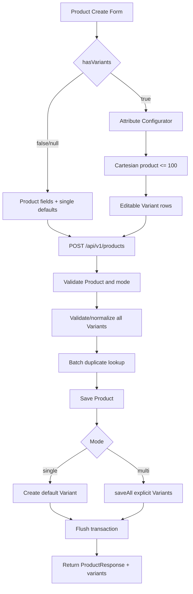

# Implementation Plan: Fix Product Management

**Feature**: `[010-fix-product-management]`  
**Created**: 2026-09-04  
**Status**: Planned  
**Sources**: `spec.md`, `clarify.md`

## 1. Mục tiêu triển khai

Mở rộng luồng `POST /api/v1/products` để tạo một Product cùng một hoặc nhiều ProductVariant trong một transaction, đồng thời tích hợp bộ cấu hình thuộc tính/SKU trực tiếp vào form thêm Product.

Kế hoạch giữ nguyên kiến trúc hiện có:

- Product vẫn là master data cha.
- ProductVariant vẫn là đơn vị giao dịch/tồn kho.
- SKU vẫn là thuộc tính unique của ProductVariant.
- Thuộc tính cấu hình chỉ là state frontend; mỗi Variant lưu snapshot trong `specsJson`.
- Không tạo tồn kho, lot hoặc serial trong feature này.
- Không thêm bảng, framework hoặc dependency mới.

## 2. Technical Context

| Hạng mục | Hiện trạng | Thay đổi |
|---|---|---|
| Backend | Java 17, Spring Boot, Spring Data JPA | Mở rộng DTO/service/repository/controller hiện có |
| Database | MySQL, `PRODUCTS`, `PRODUCT_VARIANTS` đã tồn tại | Không thêm migration schema cho feature 010 |
| Validation JSON | Jackson đã có qua Spring Web | Dùng `ObjectMapper`, không thêm thư viện |
| Frontend | React 19, Vite, form Product nằm trong `ProductPage.jsx` | Thêm component configurator và utility thuần |
| Backend test | JUnit 5, Mockito | Thêm test service/validation tập trung |
| Frontend test | Chưa có test framework riêng | Dùng `node:test` cho utility tổ hợp, không thêm dependency |
| API status | Controller hiện trả `200 OK` | Giữ nguyên để tương thích |
| Authorization | `product:add` | Giữ nguyên permission |

## 3. Phân tích hiện trạng code

### 3.1. Thành phần có thể tái sử dụng

- `ProductService.createProduct(...)` đã có `@Transactional`.
- `createDefaultVariant(...)` đã tạo default Variant cho Product single mode.
- `createVariant(...)`, `updateVariant(...)`, `deleteVariant(...)` đã cung cấp CRUD sau khi Product tồn tại.
- `ProductVariantRequest` đã có SKU, barcode, giá, MPN, specs, tracking mode, min stock, warranty và active.
- `ProductVariant` đã có đầy đủ cột cần cho feature.
- Database đã có unique constraint/index cho SKU và barcode.
- `ProductPage.jsx` đã có form Product và modal quản lý SKU sau khi tạo.

### 3.2. Khoảng trống cần xử lý

- `ProductRequest` chưa có `hasVariants` và `variants`.
- `salePrice` cấp Product đang `@NotNull`, chưa hỗ trợ validation theo mode.
- `createProduct(...)` luôn gọi `createDefaultVariant(...)`.
- Validation Variant hiện xử lý từng request, chưa phát hiện duplicate trong một batch trước khi lưu.
- Repository chưa có batch query cho tập SKU/barcode.
- `ProductResponse` chưa trả danh sách Variants vừa tạo.
- Frontend chưa có bộ sinh Cartesian product trên form tạo Product.
- Endpoint update Variant chưa khóa đổi SKU/tracking khi đã có dữ liệu vận hành.
- Audit lỗi sau khi Product đã commit có thể làm controller trả lỗi, khiến client hiểu nhầm create thất bại.

## 4. Kiến trúc giải pháp



### 4.1. Backend design

Không tạo service hoặc validator class mới. Logic dùng chung nằm trong các private method của `ProductService` vì cả create Product và CRUD Variant đã cùng thuộc service này.

Các helper dự kiến:

- `resolveVariantMode(ProductRequest)`.
- `normalizeVariantRequest(ProductVariantRequest)` hoặc mapper tương đương.
- `validateVariantBatch(Product, List<ProductVariantRequest>)`.
- `canonicalizeSpecsJson(String)`.
- `findDuplicateSkus(...)` và `findDuplicateBarcodes(...)` thông qua batch repository methods.
- `buildVariant(Product, ProductVariantRequest)`.
- `hasVariantOperationalReferences(Long variantId)` để dùng khi update/delete.

### 4.2. Frontend design

Không tiếp tục nhồi toàn bộ logic tổ hợp vào `ProductPage.jsx` vốn đã lớn. Tách đúng hai đơn vị:

- `ProductVariantConfigurator.jsx`: UI/state của thuộc tính, defaults, bảng SKU và confirm khi tái tạo.
- `variantCombinationUtils.js`: normalize, canonical key, Cartesian product, SKU slug và merge dữ liệu cũ.

Utility không phụ thuộc React để có thể kiểm thử bằng `node:test`.

`ProductPage.jsx` tiếp tục sở hữu form Product và submit payload; configurator trả về `hasVariants` và danh sách Variant cuối cùng.

## 5. Các giai đoạn triển khai

### Giai đoạn 1 - API contract và repository

1. Mở rộng `ProductRequest` với `Boolean hasVariants` và `List<ProductVariantRequest> variants`.
2. Bỏ `@NotNull` tuyệt đối trên `ProductRequest.salePrice`; chuyển sang service validation theo mode.
3. Mở rộng `ProductResponse` với `List<ProductVariantResponse> variants`.
4. Thêm batch lookup cho SKU/barcode trong `ProductVariantRepository`.
5. Không thay đổi endpoint hoặc HTTP status.

Kết quả: backend compile và vẫn nhận payload cũ.

### Giai đoạn 2 - Backend validation và create transaction

1. Xác định mode theo truth table trong `clarify.md`.
2. Single mode:
   - Validate giá/tracking/warranty cấp Product.
   - Sinh Product code nếu trống.
   - Tạo default Variant bằng luồng hiện có.
3. Multi mode:
   - Bắt buộc Product code.
   - Yêu cầu 1-100 Variant và ít nhất một Variant active.
   - Validate toàn bộ batch trước khi save Product.
   - Normalize SKU/barcode.
   - Parse `specsJson` bằng Jackson và tạo canonical key.
   - Phát hiện SKU, barcode và specs trùng trong request.
   - Batch query kiểm tra duplicate trong database.
   - Save Product, unit conversions và `saveAll` Variants trong cùng transaction.
   - Không gọi `createDefaultVariant`.
4. Flush trước khi trả response để bắt unique conflict trong transaction.
5. Bắt `DataIntegrityViolationException` tại boundary phù hợp và chuyển thành BusinessException ổn định.

Kết quả: một Product không thể được tạo thành công mà thiếu Variant hoặc chỉ lưu một phần batch.

### Giai đoạn 3 - Response, audit và guard dữ liệu vận hành

1. Create response và Product detail response trả danh sách Variant.
2. Product list không bắt buộc trả Variants để tránh N+1.
3. Audit success ghi Product ID/code/variant count.
4. Audit failure không đổi create response đã thành công.
5. Tái sử dụng kiểm tra reference hiện có trong `deleteVariant(...)` để:
   - Khóa đổi SKU khi Variant đã có giao dịch/serial/BOM.
   - Khóa đổi giữa nhóm serial-tracked và non-serial khi đã có dữ liệu vận hành.
   - Vẫn cho sửa giá, tên, MPN, min stock, warranty và active nếu không vi phạm rule khác.

Kết quả: API nhất quán với invariant trong `clarify.md`.

### Giai đoạn 4 - Utility frontend

1. Implement normalize attribute name/value.
2. Implement canonical combination key độc lập thứ tự attribute.
3. Implement Cartesian product tối đa 100 dòng.
4. Implement SKU slug/suffix với giới hạn 50 ký tự.
5. Implement merge rows theo canonical key và giữ dòng dirty.
6. Implement excluded combination keys.
7. Viết test bằng `node:test` cho utility.

Kết quả: logic khó nhất được kiểm tra độc lập trước khi gắn UI.

### Giai đoạn 5 - Product Variant Configurator UI

1. Thêm switch `Quản lý theo phiên bản/SKU`.
2. Chặn multi mode nếu Product code trống hoặc Product type là Dịch vụ.
3. Thêm tối đa 3 attribute rows và tag/value input.
4. Hiển thị số tổ hợp và giới hạn 100.
5. Thêm defaults và thao tác Apply to all.
6. Render bảng Variant với các field trong spec.
7. Theo dõi `isDirty`, `skuManuallyEdited` và `excludedCombinationKeys`.
8. Confirm khi thay đổi attribute, xóa dữ liệu hoặc tắt mode.
9. Bảo toàn row theo canonical key khi tái tạo.

Kết quả: người dùng có thể chuẩn bị payload multi-variant hoàn chỉnh trên một form.

### Giai đoạn 6 - Tích hợp ProductPage và submit

1. Chèn configurator giữa Thông tin chung và Đơn vị chuyển đổi.
2. Single mode giữ nguyên các input vận hành cấp Product.
3. Multi mode disable/ẩn các input vận hành cấp Product và dùng defaults/rows của configurator.
4. Build request đúng truth table:
   - Single: `hasVariants=false`, `variants=[]`.
   - Multi: `hasVariants=true`, `variants=[...]`.
5. Hiển thị backend error theo row index/SKU.
6. Sau create thành công, refresh Product/Variant data và reset state.
7. Giữ nguyên modal quản lý SKU của Product đã tồn tại.

Kết quả: workflow tạo Product hoàn tất trong một lần submit.

### Giai đoạn 7 - Testing và regression

1. Backend unit tests cho mode, conditional validation, duplicate batch và JSON canonicalization.
2. Backend service tests cho single/default và multi/create.
3. Test lỗi ở Variant cuối làm create thất bại toàn bộ ở transaction boundary phù hợp.
4. Frontend utility tests cho Cartesian product, canonical key, merge và SKU generation.
5. Build backend và frontend.
6. Manual/API QA với MySQL dev schema cho concurrency unique conflict.
7. Regression các endpoint Variant hiện có và create Product payload cũ.

## 6. File impact dự kiến

### Backend files sửa

- `backend/src/main/java/com/duylongtech/backend/dto/request/ProductRequest.java`
- `backend/src/main/java/com/duylongtech/backend/dto/response/ProductResponse.java`
- `backend/src/main/java/com/duylongtech/backend/repository/ProductVariantRepository.java`
- `backend/src/main/java/com/duylongtech/backend/service/ProductService.java`
- `backend/src/main/java/com/duylongtech/backend/controller/ProductController.java`
- `backend/src/main/java/com/duylongtech/backend/constant/SystemMessage.java`

### Backend tests thêm/sửa

- `backend/src/test/java/com/duylongtech/backend/service/ProductServiceVariantCreationTest.java`
- Các test ProductService hiện có nếu constructor hoặc behavior thay đổi.

### Frontend files sửa

- `frontend/src/pages/Product/ProductPage.jsx`
- `frontend/package.json` chỉ để bổ sung script chạy `node --test`, không thêm dependency.

### Frontend files thêm

- `frontend/src/pages/Product/components/ProductVariantConfigurator.jsx`
- `frontend/src/pages/Product/utils/variantCombinationUtils.js`
- `frontend/src/pages/Product/utils/variantCombinationUtils.test.js`

### Files không cần sửa

- `ProductVariant.java`: đã có đủ field.
- `SerialNumber.java`: không thuộc create Product.
- Inventory, purchase, sales, warranty, repair và assembly entities: tiếp tục tham chiếu `variantId` như hiện tại.
- Flyway migrations: không cần schema mới cho feature 010.

## 7. Validation strategy

### Frontend

- Validate sớm để người dùng biết đúng dòng lỗi.
- Không coi frontend là lớp bảo vệ dữ liệu cuối cùng.
- Mọi normalized comparison phải dùng utility chung.
- Payload luôn gửi number thực, không gửi chuỗi tiền đã format.

### Backend

- Validate lại toàn bộ rule trong `spec.md` và `clarify.md`.
- Normalize trước khi duplicate check.
- Batch check trước save.
- Database unique constraint xử lý concurrency race.
- Error trả business code và row index/SKU, không lộ SQL.

## 8. Test strategy

### Backend unit/service tests

- Payload cũ tạo một default Variant.
- `hasVariants=false` nhưng có variants bị từ chối.
- `hasVariants=true` và empty list bị từ chối.
- Multi mode Product code trống bị từ chối.
- Variant thứ 100 hợp lệ, thứ 101 bị từ chối.
- SKU/barcode trùng không phân biệt hoa thường.
- Specs cùng nội dung nhưng khác thứ tự key bị coi là trùng.
- JSON array/scalar/invalid bị từ chối.
- Product Dịch vụ không nhận multi mode.
- Thành phẩm/isAssembly bắt buộc serial tracking.
- Multi mode không gọi default Variant.
- Response chứa barcode sinh tự động.
- Update SKU/tracking bị chặn khi đã có reference.

### Frontend utility tests

- Tích Descartes với 1, 2 và 3 thuộc tính.
- Thứ tự tổ hợp ổn định.
- Canonical key không phụ thuộc thứ tự attribute.
- Normalize giữ phân biệt có dấu/không dấu khi so sánh specs.
- SKU tự sinh bỏ dấu, uppercase và <= 50 ký tự.
- SKU sửa tay không bị ghi đè.
- Merge giữ row dirty có canonical key không đổi.
- Excluded combination không tự xuất hiện lại.
- Giới hạn 100 được áp dụng trước khi cấp phát array lớn.

### Verification commands

```powershell
cd backend
.\mvnw.cmd test

cd ..\frontend
npm.cmd run test:variants
npm.cmd run build
```

## 9. Deployment strategy

1. Deploy backend trước; payload cũ vẫn hoạt động.
2. Smoke test single mode qua API.
3. Deploy frontend có multi mode.
4. Smoke test Product + 2 Variants và kiểm tra không phát sinh tồn/serial.
5. Theo dõi duplicate/business errors trong application log.

Không có migration schema nên rollback frontend/backend không yêu cầu rollback database. Product và Variant đã tạo bằng API mới vẫn tương thích với code cũ vì đều dùng các bảng hiện hữu.

## 10. Risks và biện pháp giảm thiểu

| Risk | Tác động | Giảm thiểu |
|---|---|---|
| Cartesian product quá lớn | Treo UI/payload lớn | Tính count trước, cap 100 ở FE và BE |
| Product được tạo nhưng Variant lỗi | Product rỗng | Một transaction, prevalidate batch, flush trước return |
| Duplicate do concurrency | Hai request cùng SKU | DB unique constraint + map lỗi nghiệp vụ |
| Mất dữ liệu khi đổi attribute | Người dùng nhập lại | Confirm + merge theo canonical key |
| SKU tự sinh bị cắt trùng | Sai master data | Hậu tố collision + duplicate validation |
| N+1 khi trả variants | Chậm list Product | Chỉ populate variants cho create/detail |
| Audit lỗi sau commit | Client retry tạo trùng | Audit best-effort, response create vẫn success |
| Đổi tracking sau khi có tồn | Lệch balance/serial | Guard backend dựa trên operational references |

## 11. Exit criteria

- Tất cả acceptance criteria P1 trong `spec.md` và `clarify.md` đạt.
- Backend test liên quan Product/Variant pass.
- Frontend utility test và production build pass.
- Payload cũ vẫn tạo đúng một default Variant.
- Multi mode tạo đúng N Variant và không tạo default Variant thừa.
- Không có Product orphan hoặc Product không có Variant.
- Không phát sinh Inventory Balance, Ledger, Lot hoặc Serial.
- Không cần thay đổi schema để release feature.
