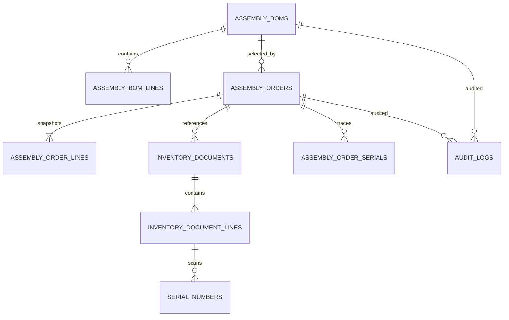

# Data Model: Fix Assembly And Disassembly Management

**Feature**: `[011-fix-assembly-and-disassembly-management]`  
**Created**: 2026-09-06  
**Status**: Implemented baseline  
**Sources**: `spec.md`, `clarify.md`

## 1. Ranh giới mô hình

Feature tái sử dụng các aggregate hiện có: BOM, Assembly Order, Inventory Document, Serial Number và Audit Log. Không tạo module sản xuất/MRP hoặc bảng giá vốn/phân bổ giá vốn mới.

`cost_allocation_pct` và công thức costing tháo dỡ **không thuộc phạm vi v011 ở thời điểm này**. Mọi field giá vốn hiện có của chứng từ kho tiếp tục giữ hành vi của module kho; feature không thêm rule hay migration costing.



## 2. State vocabulary

### 2.1. Assembly BOM

| State | Ý nghĩa | Có thể sửa cấu trúc |
|---|---|---:|
| `DRAFT` | Kỹ thuật viên đang soạn | Có |
| `PENDING_APPROVAL` | Đã gửi Kế toán | Không |
| `APPROVED` | Được dùng tạo lệnh | Không; tạo version mới nếu cần đổi |
| `REJECTED` | Bị từ chối, có lý do | Có, nếu chưa bị lock bởi lệnh hoạt động |

### 2.2. Assembly Order

| State | Ý nghĩa |
|---|---|
| `DRAFT` | Lệnh mới/chưa gửi |
| `PENDING_APPROVAL` | Chờ Kế toán duyệt |
| `REJECTED` | Kế toán từ chối, chưa sinh phiếu |
| `APPROVED` | Đã tạo đúng một cặp phiếu `DRAFT` |
| `IN_PROGRESS` | Phiếu xuất đã `POSTED`, phiếu nhập chưa `POSTED` |
| `COMPLETED` | Cả xuất và nhập đã `POSTED` |
| `CANCELLED` | Lệnh bị hủy, không được mở lại |

`CANCELLED` có trạng thái tất toán phụ `cancellationSettlementStatus` để phân biệt hủy trước khi xuất với hủy đang chờ unpost:

```text
NONE | REQUESTED | PENDING_UNPOST | SETTLED
```

`REQUESTED` là yêu cầu của Kỹ thuật viên đang chờ Kế toán xác nhận. Chỉ dùng `PENDING_UNPOST` cho hủy sau khi phiếu xuất đã `POSTED`.

### 2.3. Inventory Document liên kết lệnh

| Field | Export | Import |
|---|---|---|
| `referenceType` | `ASSEMBLY_ORDER` | `ASSEMBLY_ORDER` |
| `referenceId` | ID Assembly Order | ID Assembly Order |
| `docType` | `EX_SO` | `IN_PO` |
| `status` khi duyệt lệnh | `DRAFT` | `DRAFT` |
| `status` cuối workflow thành công | `POSTED` | `POSTED` |

Tổ hợp `(reference_type, reference_id, doc_type)` phải unique với `ASSEMBLY_ORDER` để một lệnh không có nhiều hơn một phiếu xuất hoặc một phiếu nhập. Phiếu draft bị hủy đổi `status = CANCELLED`, không bị xóa.

## 3. ASSEMBLY_BOMS

Entity hiện tại: `AssemblyBom`.

| Field | Kiểu | Thay đổi/ràng buộc |
|---|---|---|
| `id` | Long | PK hiện có |
| `status` | String(30) | Default mới `DRAFT`; chỉ nhận state ở §2.1 |
| `submittedBy`, `submittedAt` | Long, LocalDateTime | Mới; actor/lần gửi gần nhất |
| `approvedBy`, `approvedAt` | Long, LocalDateTime | Mới; actor/lần duyệt gần nhất |
| `rejectedBy`, `rejectedAt`, `rejectionReason` | Long, LocalDateTime, Text | Mới; lý do gần nhất bắt buộc khi reject |
| `versionNo` | Decimal hiện có | Không đổi; chỉ tạo version mới nếu BOM đang được lệnh hoạt động tham chiếu |
| `lines` | AssemblyBomLine[] | Không sửa khi `PENDING_APPROVAL`/`APPROVED` hoặc bị lock |

Lịch sử mọi lần submit/approve/reject phải được ghi ở `AUDIT_LOGS`; audit payload cần có BOM ID, transition và reason. Nếu UI phải hiển thị nhiều hơn lý do từ chối gần nhất, tạo bảng history riêng chỉ sau khi có yêu cầu truy vấn cụ thể.

## 4. ASSEMBLY_ORDERS

Entity hiện tại: `AssemblyOrder`.

| Field | Kiểu | Thay đổi/ràng buộc |
|---|---|---|
| `id` | Long | PK hiện có |
| `status` | String(30) | State machine §2.2; bỏ sử dụng `SUBMITTED`/`POSTED` làm status lệnh |
| `version` | Long | Mới, `@Version`; bảo vệ race giữa approve/cancel/post/unpost |
| `submittedBy`, `submittedAt` | Long, LocalDateTime | Mới |
| `approvedBy`, `approvedAt` | Long, LocalDateTime | `approvedBy` có thể tái sử dụng; bổ sung thời điểm |
| `rejectedBy`, `rejectedAt`, `rejectionReason` | Long, LocalDateTime, Text | Mới |
| `cancelRequestedBy`, `cancelRequestedAt`, `cancellationReason` | Long, LocalDateTime, Text | Mới; dùng khi hủy sau xuất kho |
| `cancelConfirmedBy`, `cancelConfirmedAt` | Long, LocalDateTime | Mới nếu chốt bước Kế toán xác nhận hủy |
| `cancelledBy`, `cancelledAt` | Long, LocalDateTime | Mới; actor thực hiện transition `CANCELLED` |
| `cancellationSettlementStatus` | String(30) | `NONE`, `REQUESTED`, `PENDING_UNPOST` hoặc `SETTLED` |
| `lines` | AssemblyOrderLine[] | Snapshot thành phần/số lượng ở lúc tạo lệnh; bất biến từ `PENDING_APPROVAL` trở đi |

`quantityProduced` hiện có không được dùng để hỗ trợ partial fulfillment trong v011. Giá trị hợp lệ chỉ là `0` khi chưa hoàn thành và `quantity` khi `COMPLETED`; có thể deprecate ở response/UI nếu không có consumer khác.

## 5. ASSEMBLY_ORDER_LINES

`ASSEMBLY_ORDER_LINES` là snapshot nghiệp vụ, không đọc lại cấu trúc từ BOM sau khi lệnh được tạo.

| Field | Quy tắc v011 |
|---|---|
| `componentVariant` | SKU component tại thời điểm lập lệnh |
| `quantityRequired` | `bomLine.quantity × order.quantity`; fixed sau `DRAFT` |
| `quantityActual` | Không cho nhập partial; phải bằng `quantityRequired` khi lệnh hoàn thành |
| `unitCost` | Giữ schema hiện có, không thay đổi/cài thêm rule costing trong v011 |

## 6. INVENTORY_DOCUMENTS và INVENTORY_DOCUMENT_LINES

Không cần entity mới. Cần bổ sung repository methods có lock và ràng buộc database:

```text
findByReferenceTypeAndReferenceIdForUpdate("ASSEMBLY_ORDER", orderId)
findByReferenceTypeAndReferenceIdAndDocType(...)
existsByReferenceTypeAndReferenceIdAndDocType(...)
```

Invariants:

1. Approval transaction chỉ tạo một `EX_SO` và một `IN_PO` cho lệnh.
2. Phiếu nhập không được `POSTED` nếu phiếu xuất chưa `POSTED`.
3. Khi lệnh là `CANCELLED`, không được post hoặc sửa phiếu nhập.
4. Chỉ unpost export khi lệnh `CANCELLED`, import chưa từng `POSTED` và mọi điều kiện trả hàng/serial trong `clarify.md` §2 đạt.
5. Unpost phải phục hồi cùng warehouse, serial status và số dư trước post; không ghi thêm một document mới.

## 7. SERIAL_NUMBERS và ASSEMBLY_ORDER_SERIALS

| Entity | Ràng buộc |
|---|---|
| `SerialNumber` | Khi post export: serial đúng variant, tồn tại tại warehouse, có thể xuất và không lặp trong request/document. Khi unpost: khôi phục trạng thái trước export. |
| `AssemblyOrderSerial` | Mapping target–component chỉ tạo/cập nhật từ chứng từ `POSTED`; không lấy serial do client gửi trực tiếp từ endpoint lệnh. |

Khuyến nghị bổ sung FK/metadata nguồn nếu entity cho phép:

```text
source_export_document_id
source_import_document_id
```

Hai field này cho phép chứng minh mapping serial được tạo bởi cặp chứng từ nào và ngăn rollback nhầm. Chính sách dùng lại/tạo serial mới khi tháo dỡ vẫn chờ xác nhận ở `clarify.md` §5.10.

## 8. AppNotification và AuditLog

Không đổi schema bắt buộc nếu entity hiện có chứa `recipientRole`, `title`, `content`, `link` và timestamps.

| Event | Recipient | Dữ liệu tối thiểu |
|---|---|---|
| BOM/lệnh submit/resubmit | `ROLE_ACCOUNTANT` | entity ID/code, actor, link detail |
| BOM/lệnh reject | Kỹ thuật viên tạo | reason, actor, link detail |
| Lệnh approved | `ROLE_WAREHOUSE_CONTROLLER` | order code, export/import document ID/code |
| Cancel chờ unpost | Thủ kho và người yêu cầu | reason, order/document ID |

Notification phải gửi sau commit để không tạo thông báo cho transaction rollback. AuditLog là immutable source cho mọi transition.

## 9. Migration strategy

Tạo migration Flyway mới sau version hiện hành (dự kiến `V55__refine_assembly_workflow.sql`; xác nhận số version trước khi tạo).

Migration gồm:

1. Đổi default `ASSEMBLY_BOMS.status` sang `DRAFT`.
2. Bổ sung metadata workflow cho BOM/lệnh và `ASSEMBLY_ORDERS.version`.
3. Bổ sung `cancellation_settlement_status` default `NONE`.
4. Tạo unique index cho assembly export/import theo `reference_type`, `reference_id`, `doc_type`.
5. Backfill trạng thái cũ theo bảng mapping được QA duyệt; không tự suy đoán trạng thái lệnh đang dang dở.

| State cũ | Mapping đề xuất | Cần kiểm tra thủ công |
|---|---|---:|
| BOM `APPROVED` | `APPROVED` | Không |
| BOM `DRAFT` | `DRAFT` | Không |
| Order `DRAFT` | `DRAFT` | Không |
| Order `SUBMITTED` | `PENDING_APPROVAL` hoặc `IN_PROGRESS` tùy chứng từ | Có |
| Order `POSTED` | `COMPLETED` nếu cả phiếu đã post | Có |
| Order `APPROVED` | `APPROVED` hoặc `IN_PROGRESS` tùy export | Có |

Migration không bao gồm cost allocation, inventory reservation hoặc cơ chế phế liệu; chỉ thêm chúng ở feature riêng sau khi các decision tương ứng được chốt.
