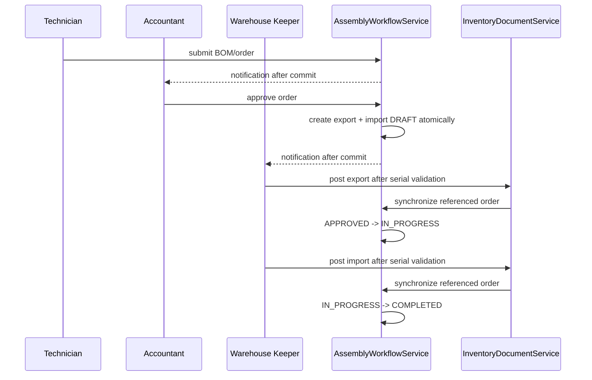

# Implementation Plan: Fix Assembly And Disassembly Management

**Feature**: `[011-fix-assembly-and-disassembly-management]`  
**Created**: 2026-09-06  
**Status**: In Progress — Decision Gate closed  
**Sources**: `spec.md`, `clarify.md`, `data-model.md`

## 1. Outcome

Thay thế các đường đi hiện tại cho phép tự duyệt, tự tạo chứng từ thủ công hoặc “execute” trực tiếp bằng một workflow có kiểm soát: Kỹ thuật viên gửi, Kế toán duyệt, hệ thống tạo đúng một cặp phiếu `DRAFT`, Thủ kho post xuất/nhập, và hệ thống tự hoàn tất lệnh.

Không triển khai cost allocation/costing mới, partial fulfillment hoặc MRP trong feature này.

## 2. Decision Gate — completed

Các mục sau đã được chốt trong `clarify.md` §5:

1. Lệnh `REJECTED` có được sửa/resubmit.
2. Quyền request/confirm cancel sau export post.
3. Luồng xử lý hàng hỏng thật, lắp vật lý một phần và reversal sau import post.
4. Có hay không inventory reservation sau approval.
5. Chính sách serial khi tháo dỡ, quantity nguyên của hàng serial và hành vi phiếu `DRAFT` quá hạn.

Quy tắc triển khai: cho resubmit lệnh bị từ chối; Kỹ thuật viên yêu cầu và Kế toán xác nhận hủy; không reservation; reversal/hàng hỏng vật lý ngoài scope; serial tháo dỡ ưu tiên serial cũ.

## 3. Technical context

| Thành phần | Hướng xử lý |
|---|---|
| Backend | Java/Spring Boot; tái sử dụng `AssemblyOrderService`, `InventoryDocumentService`, Spring Security và `AuditLogService` |
| Database | MySQL/Flyway; migration mới sau version hiện hành |
| Concurrency | `@Version` trên AssemblyOrder + lock/re-read chứng từ trong transaction |
| Inventory | Chỉ đi qua `InventoryDocumentService.postExport/postImport/unpost*`; không cập nhật balance/serial trực tiếp từ AssemblyOrderService |
| Frontend | React; thay action “Duyệt lệnh (Lưu)”, “Thực thi” và “Hoàn thành” bằng actions theo workflow |
| Notification | Tái sử dụng `AppNotificationService`, gọi sau commit |
| Cost allocation | Explicitly excluded; không thêm field, công thức hay test mới |

## 4. Current-code changes

| Hiện trạng | Thay đổi |
|---|---|
| `AssemblyBom.status` default `APPROVED` | Default `DRAFT`; chỉ action approve của Kế toán mới đặt `APPROVED` |
| `AssemblyOrderService.updateOrderStatus(...)` nhận status chung | Thay bằng transition service/action endpoint có role guard |
| `generateInventoryDocument(...)` nhận lines từ client | Chuyển thành internal factory gọi khi approve; lines lấy từ snapshot order |
| `/assembly-orders/{id}/execute` | Deprecate/remove UI + endpoint, không bypass phiếu kho |
| `postExport/postImport` chưa đồng bộ order | Gọi workflow coordinator sau post/unpost document tham chiếu `ASSEMBLY_ORDER` |
| UI duyệt/execute/complete thủ công | Render action theo role/state; hiển thị hai document liên kết và pending-unpost |

## 5. Architecture

`AssemblyWorkflowService` là coordinator state machine; `InventoryDocumentService` vẫn là nơi duy nhất thay đổi inventory balance, serial, ledger và document status.

## 6. Phases

### Phase 0 — Decision and characterization

- Chốt checklist `clarify.md` §6 và cập nhật file thành decision cuối.
- Ghi nhận API/UI regression hiện tại bằng test, đặc biệt `/execute`, `updateOrderStatus`, create/generate document và post/unpost.
- Kiểm tra migration version cuối cùng và dữ liệu trạng thái production/staging trước khi đặt mapping.

Static audit đã ghi nhận các state legacy trong code/schema: BOM `DRAFT`, `APPROVED`, `INACTIVE`; Order `DRAFT`, `SUBMITTED`, `APPROVED`, `POSTED`, `CANCELLED`. Migration v011 map `SUBMITTED`/`POSTED` sang `COMPLETED` và `APPROVED` có export đã post sang `IN_PROGRESS`. Chưa chạy migration trên database staging; việc đó vẫn thuộc release gate.

### Phase 1 — Schema, state model and repository foundation

- Thêm migration workflow fields, unique index và optimistic version theo `data-model.md`.
- Chuẩn hóa constants/enums state; không dùng magic string rải rác.
- Thêm repository query có lock để lấy một order cùng cặp document liên kết.
- Viết migration/backfill test và uniqueness/concurrency tests.

### Phase 2 — BOM workflow

- Implement create draft, submit, approve, reject, resubmit theo role.
- Lưu actor/reason/audit, notification after commit.
- Khóa BOM đang được active order tham chiếu; preserve version behavior.
- Thay UI BOM để trạng thái/action phản ánh quyền thực.

### Phase 3 — Order approval and document generation

- Implement create/update draft, submit/reject/resubmit (nếu được chốt), approve.
- Approval re-check BOM, warehouse, availability policy và atomically tạo cặp document.
- Enforce uniqueness/idempotency trên retry và concurrent approve.
- Remove manual document generation from public workflow.

### Phase 4 — Warehouse posting, serial and automatic completion

- Đưa serial/SKU/warehouse/quantity validation vào backend post service.
- Chặn post import trước export và chặn update import khi order cancelled.
- Đồng bộ order `APPROVED -> IN_PROGRESS -> COMPLETED` sau post; update `quantityProduced` theo all-or-nothing.
- Create/generate serial genealogy only from posted documents.

### Phase 5 — Cancel/unpost and recovery

- Implement cancellation before post: cancel both draft documents with audit.
- Implement cancellation after export post only theo decision đã chốt; track `pendingUnpost` và restore inventory/serial using existing unpost service.
- Lock race Cancel/Post/Unpost; forbid unsafe unpost after import post.
- Chỉ implement scrap/reversal nếu business decision đã đưa chúng vào scope; nếu chưa, trả business error hướng dẫn đúng.

### Phase 6 — Security, notification and frontend

- Áp `ROLE_TECHNICIAN`, `ROLE_ACCOUNTANT`, `ROLE_WAREHOUSE_CONTROLLER` ở backend endpoints/service, lấy actor từ principal.
- Bổ sung notification và deep links sau commit; failure notification không rollback nghiệp vụ đã commit.
- Refactor `AssemblyBomFormPage`, `AssemblyOrderFormPage`, `AssemblyExecutionModal` và API client; xóa UI action bypass.
- Hiển thị cặp chứng từ, trạng thái post, cancel pending-unpost và lý do reject.

### Phase 7 — Verification and release

- Unit/service tests state machine, authorization, idempotency, atomicity, serial validation, cancel/unpost and concurrent actions.
- API integration tests, migration test và manual role-based E2E.
- Build backend/frontend, OpenAPI review, migration rehearsal trên backup/staging.

## 7. API contract direction

| Action | Endpoint đề xuất | Actor |
|---|---|---|
| Submit BOM | `POST /api/v1/assembly-boms/{id}/submit` | Technician |
| Approve/reject BOM | `POST /api/v1/assembly-boms/{id}/approve`, `/reject` | Accountant |
| Submit order | `POST /api/v1/assembly-orders/{id}/submit` | Technician |
| Approve/reject order | `POST /api/v1/assembly-orders/{id}/approve`, `/reject` | Accountant |
| Request/confirm cancel | Endpoint riêng, final route theo Decision Gate | Technician/Accountant |
| List pair documents | `GET /api/v1/assembly-orders/{id}/inventory-documents` | authorized viewer |

Các endpoint cũ `PUT .../status`, `POST .../inventory-documents`, `POST .../execute` phải bị loại bỏ/deprecate sau khi client đã chuyển sang API mới; không giữ đường gọi cũ không có role/state guard.

## 8. Verification matrix

| Nhóm | Critical checks |
|---|---|
| BOM | Draft → submit → reject → edit/resubmit → approve; reason/audit/role |
| Approval | Retry/concurrent approve chỉ tạo một export và một import; rollback nếu tạo pair lỗi |
| Warehouse | Thiếu/trùng/sai SKU/sai kho serial không post; import trước export bị chặn |
| Completion | Cả hai `POSTED` mới completed; không có complete manual/partial quantity |
| Cancellation | Before-post cancel; after-export cancel/unpost; import-post blocks unpost; concurrent race |
| Security | Client không spoof được `createdBy`/`approvedBy`; role sai nhận 403/business error |
| Regression | Không còn `/execute` hoặc manual generate workflow từ UI/API |

## 9. Definition of Done

- Decision Gate đã đóng và `clarify.md` ghi rõ quyết định cuối cùng.
- Migration chạy sạch trên dữ liệu test và mapping trạng thái cũ được QA chấp thuận.
- Một lệnh được duyệt chỉ có đúng một cặp phiếu kho `DRAFT`.
- Role/state checks có ở backend; frontend không còn action bypass.
- Tồn, serial và document chỉ thay đổi qua InventoryDocumentService.
- All-or-Nothing được test end-to-end; không có partial completion.
- Không có code/schema/rule cost allocation mới trong feature này.
- Backend test/build và frontend build pass; OpenAPI và QA checklist hoàn tất.
