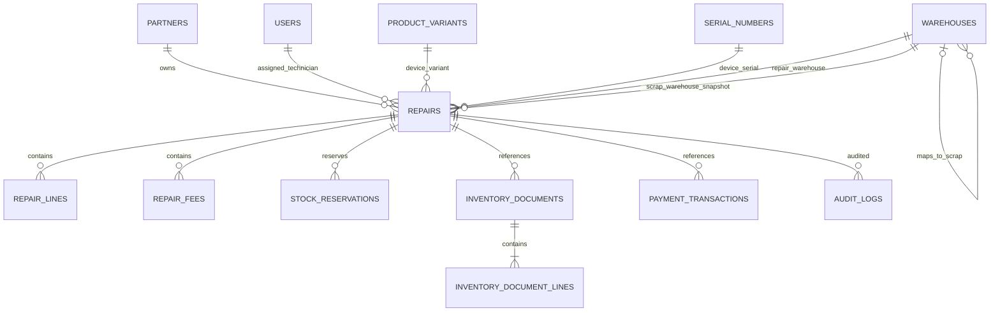

# Data Model: Fix Repair Management

**Feature**: `[012-fix-repair-management]`  
**Updated**: 2026-09-16  
**Sources**: `spec.md`, `clarify.md`

## 1. Mô hình tổng quát

V012 mở rộng các entity hiện có, không tạo một hệ thống tồn kho hoặc thanh toán song song.



## 2. State vocabulary

### 2.1 Repair status

| State | Ý nghĩa | Mutable data |
|---|---|---|
| `DRAFT` | Kế toán đang tiếp nhận hoặc sửa phiếu bị trả | Header, Partner, device, policy, KTV, kho, đề xuất parts |
| `WAITING_CONFIRM` | Chờ KTV được phân công chẩn đoán/accept/reject | Diagnosis, parts, labor fees |
| `WAITING_STOCK` | Reservation và `PARTS_EXPORT DRAFT` đã tồn tại | Chỉ serial/chứng từ kho bởi Thủ kho |
| `IN_REPAIR` | Vật tư cần thiết đã xuất hoặc không cần xuất | Outcome và hàng tháo thực tế qua finish action |
| `WAITING_SCRAP_RETURN` | Chờ nhận và post hàng tháo | Chỉ `SCRAP_IMPORT` bởi Thủ kho |
| `DONE` | Kỹ thuật/kho hoàn tất | Chỉ payment và handover metadata |
| `CANCELLED` | Hủy hợp lệ trước khi dùng vật tư | Không |

### 2.2 Fee policy

```text
WARRANTY | PAID | PARTIAL
```

### 2.3 Repair outcome

```text
SUCCESS | FAILED | CUSTOMER_DECLINED | UNREPAIRABLE
```

### 2.4 Inventory document role

```text
PARTS_EXPORT | SCRAP_IMPORT
```

`documentRole` chỉ mô tả vai trò của document đối với Repair; `docType`, `issuePurpose` và `status` vẫn dùng vocabulary của Inventory hiện có.

## 3. `REPAIRS`

Entity hiện tại: `backend/.../feature/repair/Repair.java`.

### 3.1 Trường giữ lại

| Field | Kiểu | Quy tắc |
|---|---|---|
| `id` | `BIGINT` | PK |
| `repair_code` | `VARCHAR(50)` | Not null, unique, backend sinh |
| `partner_id` | `BIGINT` | Not null, FK Partner có `is_customer = true` |
| `product_variant_id` | `BIGINT` | Nullable cho thiết bị ngoài |
| `serial_number_id` | `BIGINT` | Nullable cho thiết bị ngoài; phải thuộc đúng variant |
| `warehouse_id` | `BIGINT` | Kho sửa chữa/kho xuất chính |
| `received_date`, `expected_date` | `DATE` | Giữ semantics hiện hành |
| `diagnosis_note`, `internal_notes`, `note` | `TEXT` | Chỉ role/state thích hợp được sửa |
| `total_amount` | `DECIMAL(15,4)` | Snapshot tổng tiền; không tin giá trị client |
| `version` | `INT` | `@Version` |
| `created_at`, `updated_at` | `DATETIME` | Server timestamps |

### 3.2 Trường mới hoặc thay thế

| Field | Kiểu đề xuất | Null/default | Ràng buộc |
|---|---|---|---|
| `repair_status` | `VARCHAR(30)` | `NOT NULL DEFAULT 'DRAFT'` | Chỉ state §2.1 |
| `assigned_technician_id` | `BIGINT` | Nullable khi tạo, bắt buộc trước submit | FK `USERS`; user active và có `ROLE_TECHNICIAN` |
| `fee_policy` | `VARCHAR(20)` | Nullable khi tạo, bắt buộc trước submit | `WARRANTY`, `PAID`, `PARTIAL` |
| `customer_share_percent` | `DECIMAL(5,2)` | Nullable | 0–100; policy quyết định giá trị hợp lệ |
| `customer_pay_amount` | `DECIMAL(15,4)` | `NOT NULL DEFAULT 0` | Snapshot khi `DONE`, không âm |
| `company_covered_amount` | `DECIMAL(15,4)` | `NOT NULL DEFAULT 0` | Snapshot khi `DONE`, không âm |
| `fee_adjusted_by` | `BIGINT` | Nullable | FK user hoặc actor ID theo convention hiện có |
| `fee_adjusted_at` | `DATETIME` | Nullable | Server timestamp |
| `fee_adjustment_reason` | `TEXT` | Nullable | Bắt buộc khi policy/tỷ lệ bị thay đổi sau lần lưu đầu |
| `external_condition` | `TEXT` | Nullable khi tạo, bắt buộc trước submit | Tình trạng ngoại quan |
| `customer_complaint` | `TEXT` | Nullable khi tạo, bắt buộc trước submit | Phản ánh khách hàng |
| `manual_device_name` | `VARCHAR(255)` | Nullable | Bắt buộc cùng identifier khi không có device serial |
| `manual_device_identifier` | `VARCHAR(255)` | Nullable | Cảnh báo trùng active, không unique cứng |
| `scrap_warehouse_id` | `BIGINT` | Nullable khi tạo, bắt buộc trước submit | Snapshot FK warehouse `SCRAP` active |
| `repair_outcome` | `VARCHAR(30)` | Nullable đến finish | Vocabulary §2.3 |
| `reject_reason` | `TEXT` | Nullable | Bắt buộc khi reject |
| `rejected_at`, `submitted_at`, `accepted_at`, `completed_at`, `cancelled_at` | `DATETIME` | Nullable | Server timestamp |
| `rejected_by`, `submitted_by`, `accepted_by`, `completed_by`, `cancelled_by` | `BIGINT` | Nullable | Actor từ principal |
| `cancel_reason` | `TEXT` | Nullable | Bắt buộc khi cancel |
| `returned_at` | `DATETIME` | Nullable | Chỉ sau `DONE` |
| `returned_by` | `BIGINT` | Nullable | Kế toán từ principal |
| `recipient_name` | `VARCHAR(150)` | Nullable | Bắt buộc khi return-device |
| `recipient_phone` | `VARCHAR(20)` | Nullable | Bắt buộc và validate khi return-device |
| `return_note` | `TEXT` | Nullable | Metadata bàn giao |
| `handover_code` | `VARCHAR(50)` | Nullable | Unique khi có giá trị; server sinh |

### 3.3 Field deprecation

| Field hiện tại | Xử lý |
|---|---|
| `responsible_person` | Backfill sang `assigned_technician_id` khi map chắc chắn; giữ read-only tạm thời trong migration rồi loại bỏ sau |
| `under_warranty` | Không nhận từ client; derive từ warranty và `fee_policy`; deprecate sau khi backfill |
| `repair_cost` | Giữ backward compatibility nếu còn consumer; không dùng làm nguồn tài chính mới |
| `approved_by` | Không dùng chung cho mọi transition; map sang metadata action cụ thể nếu an toàn |

### 3.4 Invariants

1. `customer_pay_amount + company_covered_amount = total_amount` khi `DONE`.
2. `WARRANTY` có percent/customer amount bằng 0.
3. `PAID` có percent 100 và company amount bằng 0.
4. `PARTIAL` có percent lớn hơn 0 và nhỏ hơn 100.
5. Device trong hệ thống: `serial_number_id` và `product_variant_id` hợp lệ cùng nhau.
6. Device ngoài: cả `manual_device_name` và `manual_device_identifier` đều có giá trị.
7. `DONE` cần `completed_at/by` và `repair_outcome`.
8. `CANCELLED` cần `cancel_reason/at/by`.

Cross-table/state invariants được kiểm tra trong domain service; không cố biểu diễn toàn bộ bằng database check constraint.

## 4. `REPAIR_LINES`

Entity hiện tại: `RepairLine`.

| Field | Kiểu/semantics v012 |
|---|---|
| `action_type` | `ADD`, `REPLACE`, `REMOVE` |
| `component_variant_id` | Variant lắp mới với `ADD/REPLACE`; variant tháo với `REMOVE` nếu schema hiện tại dùng chung |
| `quantity` | `DECIMAL(15,4) > 0`; SKU serial phải là số nguyên |
| `unit_price`, `vat_percent` | Snapshot được backend tính/chốt theo rule giá hiện tại |
| `install_serial_ids` | Quan hệ/bảng con tới serial lắp mới; chỉ Thủ kho xác nhận qua export document |
| `removed_variant_id` | Variant thực tế tháo cũ cho `REPLACE`; với `REMOVE` có thể trùng component variant |
| `removed_quantity` | Số lượng thực tế tháo, nullable đến finish |
| `removed_serial_ids` | Quan hệ/bảng con hoặc mapping tới serial tháo cũ |
| `scrap_condition` | Bắt buộc nếu có removed quantity |
| `added_by`, `accepted_by` | Metadata audit khi cần hiển thị trực tiếp |

Ưu tiên tái sử dụng dòng chứng từ/serial mapping hiện có thay vì lưu danh sách ID dạng JSON hoặc CSV. Client không được gửi free-text thay serial ID khi serial đã tồn tại trong hệ thống.

## 5. `REPAIR_FEES`

- Giữ entity hiện tại và công thức `fee_amount × quantity + VAT`.
- Chỉ KTV được phân công sửa ở `WAITING_CONFIRM`; Kế toán không sửa sau submit.
- Giá/phí là snapshot sau accept; sau đó không cập nhật trực tiếp.
- `WARRANTY` không cần sửa từng dòng về 0 nếu hệ thống vẫn cần theo dõi tổng chi phí thực; phần khách trả được quyết định bởi fee policy. Nếu code hiện tại bắt buộc zero-price, migration/implementation phải chọn một nguồn chi phí nội bộ duy nhất và thêm characterization test trước khi đổi.

## 6. `WAREHOUSES`

Entity hiện tại đã có `type = STANDARD|SCRAP`.

Thêm self-reference:

| Field | Kiểu | Quy tắc |
|---|---|---|
| `scrap_warehouse_id` | `BIGINT NULL` | FK `WAREHOUSES(id)`, `ON DELETE RESTRICT` |

Rule service:

- Warehouse `STANDARD` dùng cho Repair phải map tới warehouse khác, active/approved, `type = SCRAP`.
- Warehouse `SCRAP` không cần tự map.
- Không cho deactivate/delete scrap warehouse đang được warehouse active hoặc Repair active tham chiếu.

## 7. `INVENTORY_DOCUMENTS`

Entity hiện tại đã có `reference_type`, `reference_id`, `doc_type`, `issue_purpose`, `status`.

Thêm:

| Field | Kiểu | Quy tắc |
|---|---|---|
| `document_role` | `VARCHAR(30)` | Nullable với document legacy; bắt buộc khi `reference_type = REPAIR` |

Unique business key:

```text
(reference_type, reference_id, document_role)
```

Vì MySQL cho phép nhiều `NULL` trong unique index, document không thuộc Repair không bị ảnh hưởng. Với Repair:

| Role | Doc direction | `issuePurpose` | Warehouse |
|---|---|---|---|
| `PARTS_EXPORT` | Xuất | `REPAIR` | `repair.warehouseId` hoặc warehouse snapshot trên dòng |
| `SCRAP_IMPORT` | Nhập | `SCRAP` | `repair.scrapWarehouseId` |

Document bị hủy đổi status theo vocabulary hiện có, không xóa lịch sử sau khi đã được audit/tham chiếu.

## 8. `STOCK_RESERVATIONS`

Schema hiện tại bắt buộc `sales_order_id`; v012 cần cho reservation thuộc Repair.

Thay đổi tối thiểu:

| Field | Thay đổi |
|---|---|
| `sales_order_id` | Cho phép nullable |
| `repair_id` | Thêm `BIGINT NULL`, FK `REPAIRS(id)` |
| `status` | Giữ `HOLDING`, `FULFILLED`, `RELEASED` |

Ràng buộc logic: đúng một owner (`sales_order_id` hoặc `repair_id`) phải có giá trị. Thêm unique:

```text
(repair_id, variant_id, warehouse_id)
```

Reservation được tạo cùng transaction accept, fulfil khi export post, release khi export draft bị hủy hoặc Repair bị cancel trước post.

## 9. `PAYMENT_TRANSACTIONS`

Entity hiện tại chỉ gắn Partner. Bổ sung:

| Field | Kiểu | Quy tắc |
|---|---|---|
| `reference_type` | `VARCHAR(30)` | `REPAIR` với payment của Repair |
| `reference_id` | `BIGINT` | Repair ID |
| `idempotency_key` | `VARCHAR(100)` | Unique khi có giá trị; backend/client workflow sinh ổn định |
| `created_by` | `BIGINT` | Actor từ principal nếu audit hiện tại chưa đủ |

Unique đề xuất cho v012:

```text
(reference_type, reference_id, type)
```

Nếu nghiệp vụ cho phép nhiều lần thu cho một Repair trong tương lai, bỏ unique theo type và chỉ dùng `idempotency_key`; v012 hiện chỉ yêu cầu một chứng từ theo loại/reference.

## 10. Audit và notification

Tái sử dụng `AUDIT_LOGS` và `APP_NOTIFICATIONS`; không thêm bảng history riêng trong v012.

Audit tối thiểu:

```text
actor, action, entityType, entityId, oldState, newState,
documentId/referenceId, timestamp, reason
```

Notification cần một event key ổn định, ví dụ:

```text
REPAIR:{repairId}:{eventType}:{entityVersion}
```

Nếu bảng notification chưa hỗ trợ unique event key, de-duplicate trong service/repository bằng business reference hiện có; không rollback workflow khi gửi notification lỗi.

## 11. Migration strategy

Migration mới phải dùng version sau migration hiện hành `V56`; xác nhận lại ngay trước khi tạo, dự kiến `V57__fix_repair_management.sql`.

Thứ tự:

1. Thêm các cột nullable/default an toàn.
2. Thêm `WAREHOUSES.scrap_warehouse_id`, `STOCK_RESERVATIONS.repair_id`, payment reference và document role.
3. Backfill các field có thể suy ra chắc chắn.
4. Map trạng thái feature 007.
5. Báo cáo các lệnh `CONFIRMED` không có export/reservation hợp lệ và đưa về `WAITING_CONFIRM`.
6. Thêm index/unique/FK sau khi xử lý duplicate.
7. Thay check constraint trạng thái cuối cùng.

| State cũ | Mapping |
|---|---|
| `DRAFT` | `DRAFT` |
| `QUOTATION` | `DRAFT` |
| `CONFIRMED` | `WAITING_STOCK` nếu có export/reservation hợp lệ; nếu không `WAITING_CONFIRM` |
| `UNDER_REPAIR` | `IN_REPAIR` |
| `DONE` | `DONE` |
| `CANCELLED` | `CANCELLED` |

Không tự đoán `assignedTechnicianId` từ tên không unique. Các bản ghi không map chắc chắn phải được xuất báo cáo để xử lý thủ công hoặc dùng tài khoản/KTV migration được PO phê duyệt.
