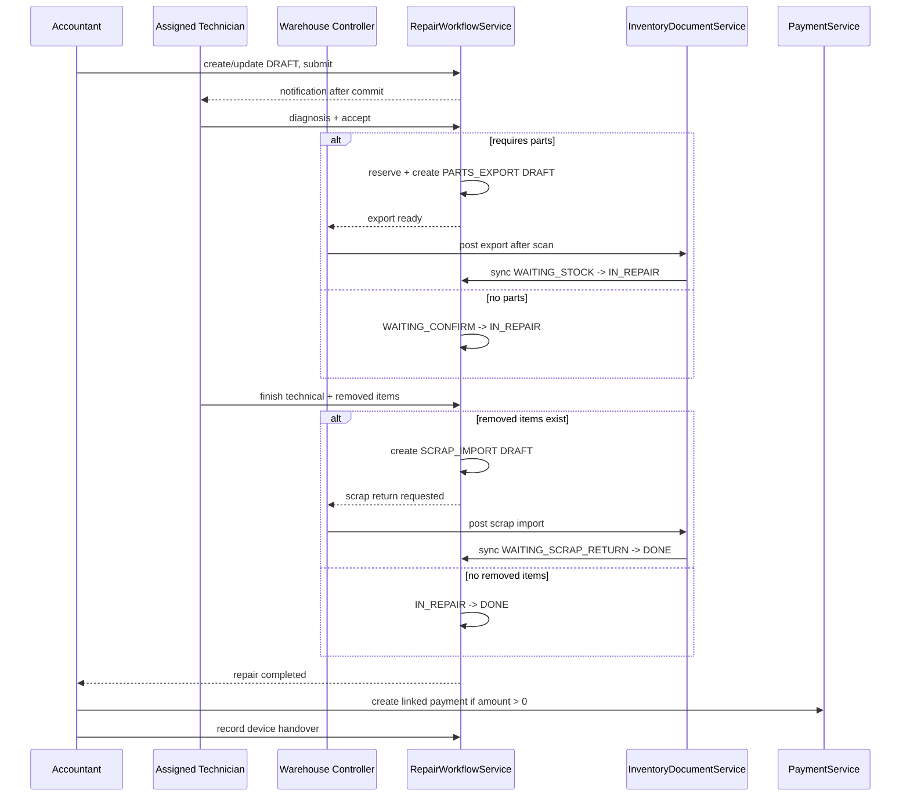

# Implementation Plan: Fix Repair Management

**Feature**: `[012-fix-repair-management]`  
**Updated**: 2026-09-16  
**Status**: Ready for Implementation  
**Sources**: `spec.md`, `clarify.md`, `data-model.md`

## 1. Outcome

Thay workflow Repair hiện tại bằng quy trình phân vai bắt buộc: Kế toán tiếp nhận/submit, KTV được phân công chẩn đoán/accept/finish, Thủ kho post chứng từ, và backend tự đồng bộ trạng thái Repair.

Feature hoàn thành khi không còn đường UI/API cho client tự đặt status, mỗi Repair tạo tối đa một chứng từ theo vai trò, tồn/serial/reservation nhất quán, fee split được snapshot đúng, và Payment/bàn giao chỉ xảy ra sau `DONE`.

## 2. Decision Gate — completed

Các quyết định trong `clarify.md` đã chốt:

1. `PARTIAL` dùng tỷ lệ khách chịu trên toàn lệnh.
2. Không cancel sau khi vật tư đã sử dụng; v012 không thêm `PARTS_RETURN`.
3. Kho phế phẩm map theo từng kho sửa chữa và snapshot trên Repair.
4. `partnerId` bắt buộc; hỗ trợ quick-create Partner.
5. v012 chỉ lưu metadata bàn giao; OTP để feature sau.
6. `DONE` phản ánh hoàn tất kỹ thuật và kho, không phụ thuộc payment/return.

## 3. Technical context

| Thành phần | Hướng xử lý |
|---|---|
| Backend | Java/Spring Boot; refactor `RepairService`, `RepairWorkflowService`, Inventory/Payment integration |
| Database | MySQL/Flyway; migration sau `V56`, xác nhận lại version khi bắt đầu |
| Concurrency | `@Version` + pessimistic row lock ở action tạo/release reservation/document |
| Inventory | Chỉ thay đổi qua `InventoryDocumentService`/posting service hiện có |
| Reservation | Mở rộng `STOCK_RESERVATIONS` để có owner Repair |
| Payment | Mở rộng transaction hiện có bằng Repair reference/idempotency |
| Frontend | React; action endpoint theo role/state, không dùng status update chung |
| Notification/Audit | Reuse services hiện có, notification after-commit |

## 4. Architecture



`RepairWorkflowService` điều phối state; Inventory/Payment services sở hữu side effects của domain mình. Không cập nhật trực tiếp inventory balance, serial hoặc partner ledger từ Repair code.

## 5. Phases

### Phase 0 — Characterization và migration audit

- Ghi characterization tests cho state/API cũ, đặc biệt `transitionStatus`, `handleConfirm`, `handleDone`, document generation và unpost.
- Kiểm tra migration version mới nhất và schema thực tế sau `V21`, `V23`, `V56`.
- Chạy query thống kê Repair theo status, duplicate documents, responsible person không map được, kho thiếu SCRAP mapping.
- Chốt quy tắc money scale theo Payment/Repair schema thực tế trước khi tạo migration.

**Exit**: Có baseline test và báo cáo dữ liệu cần backfill thủ công.

### Phase 1 — Schema và domain vocabulary

- Tạo migration theo `data-model.md`.
- Cập nhật Repair status/policy/outcome/document-role enums.
- Cập nhật entity Repair, Warehouse, StockReservation, InventoryDocument, PaymentTransaction.
- Thêm unique/index/FK sau bước cleanup/backfill.
- Thêm repository queries có lock.

**Exit**: Migration chạy/rollback rehearsal trên snapshot đại diện; entity boot thành công.

### Phase 2 — Security và intake

- Thu hẹp Repair create/update DTO; không nhận status/actor/snapshot amount.
- Enforce Accountant create/update/submit.
- Validate Partner, device/internal vs external, active technician, warehouse và fee policy.
- Resolve/snapshot scrap warehouse khi submit.
- Reuse Customer Service và Customer modal cho quick-create Partner.
- Thêm active-device concurrency check.

**Exit**: `DRAFT → WAITING_CONFIRM` hoạt động đúng role, audit và notification.

### Phase 3 — Technician diagnosis, reject và accept

- Thêm diagnosis endpoint chỉ cho assigned KTV.
- Implement reject có reason và resubmit qua Accountant.
- Implement accept không parts đi thẳng `IN_REPAIR`.
- Implement accept có parts: lock tồn, reservation + one export draft atomically.
- Idempotent retry/concurrent accept.

**Exit**: Toàn bộ nhánh `WAITING_CONFIRM` được test, không có duplicate/orphan.

### Phase 4 — Warehouse export integration

- Validate Repair-linked export trong posting service.
- Enforce warehouse role/access, serial, variant, quantity, reservation và available stock.
- Fulfil reservation và sync Repair sang `IN_REPAIR` trong transaction.
- Implement cancel export draft/release reservation.
- Implement safe export unpost và Repair quay về `WAITING_STOCK`.

**Exit**: Chỉ warehouse post thành công mới làm lệnh bắt đầu sửa; rollback không làm lệch kho/state.

### Phase 5 — Finish technical và scrap return

- Thêm finish request với outcome và removed item snapshots.
- Không removed item: snapshot amount và chuyển `DONE`.
- Có removed item: tạo idempotent `SCRAP_IMPORT DRAFT`, chuyển `WAITING_SCRAP_RETURN`.
- Enforce scrap warehouse access và post validation.
- Post scrap import chuyển `DONE`; block unpost sau `DONE`.

**Exit**: Hai nhánh finish đúng document/state, không có scrap document giả hoặc rỗng.

### Phase 6 — Fee split, Payment và handover

- Centralize `WARRANTY/PAID/PARTIAL` calculation bằng `BigDecimal`.
- Snapshot tổng, khách trả, công ty chịu khi `DONE`.
- Mở rộng Payment reference/idempotency; tạo phiếu chỉ sau `DONE` và amount > 0.
- Thêm return-device metadata/idempotency và printable handover data.
- Không tích hợp OTP.

**Exit**: Money invariant, payment link và handover được test độc lập.

### Phase 7 — Frontend workflow

- Cập nhật state labels/filter trong list/detail.
- Thay `updateRepairStatus` bằng action APIs.
- Chia form theo role/state; khóa fields đúng ownership.
- Thêm diagnosis/reject/accept/finish modals hoặc sections tối thiểu.
- Chuyển serial xuất sang linked inventory document.
- Thêm linked documents, fee split, quick customer và return-device UI.
- Bỏ nút “Bắt đầu sửa chữa”, “Kết thúc sửa chữa” cũ và mọi status payload.

**Exit**: Mỗi role chỉ thấy action hợp lệ và backend error được hiển thị đúng.

### Phase 8 — Regression, migration và release

- Unit/service/integration tests theo verification matrix.
- Backend build, frontend test/build.
- Migration rehearsal trên dữ liệu feature 007 đại diện và kiểm tra orphan/duplicate.
- Manual E2E với Accountant, assigned/unassigned Technician, Warehouse Controller.
- Review OpenAPI, permission seed và rollback/runbook.

**Exit**: Definition of Done trong `spec.md` đạt đầy đủ.

## 6. API direction

| Action | Route đề xuất | Actor |
|---|---|---|
| Create/update draft | `POST /api/v1/repairs`, `PUT /api/v1/repairs/{id}` | Accountant |
| Submit | `POST /api/v1/repairs/{id}/submit` | Accountant |
| Save diagnosis | `PUT /api/v1/repairs/{id}/diagnosis` | Assigned Technician |
| Accept/reject | `POST /api/v1/repairs/{id}/accept`, `/reject` | Assigned Technician |
| Finish technical | `POST /api/v1/repairs/{id}/finish-technical` | Assigned Technician |
| Cancel | `POST /api/v1/repairs/{id}/cancel` | Accountant |
| Linked documents | `GET /api/v1/repairs/{id}/inventory-documents` | Authorized viewer |
| Payment | `POST /api/v1/repairs/{id}/payment-documents` | Accountant |
| Return device | `POST /api/v1/repairs/{id}/return-device` | Accountant |

Route prefix cuối cùng phải theo convention của `RepairController` hiện tại. Không giữ endpoint status chung như một alias có thể bypass role/state.

## 7. Dependencies và thứ tự bắt buộc

```text
Migration/domain model
  → repository locks/unique keys
  → workflow actions
  → inventory callbacks
  → payment/handover
  → frontend
  → end-to-end verification
```

- Không làm UI action trước backend guard.
- Không tạo reservation Repair trước khi schema owner được quyết định.
- Không bật Payment Repair trước unique reference/idempotency.
- Không xóa compatibility field/status trước khi migration/backfill và frontend rollout hoàn tất.

## 8. Rủi ro và biện pháp

| Rủi ro | Biện pháp |
|---|---|
| Constraint Repair status bị định nghĩa khác nhau ở `V21`/`V23` | Inspect schema thật; drop đúng constraint trước update và add lại sau backfill |
| `responsiblePerson` không map được User | Không đoán theo tên trùng; report/manual mapping trước khi bắt buộc FK |
| Concurrent accept tạo duplicate | Repair row lock + DB unique business key + duplicate-key handling |
| Race accept/post/cancel/unpost | Lock ordering thống nhất và integration tests đồng thời |
| Tồn UI khác tồn lúc post | UI chỉ preview; revalidate/lock ở backend post |
| Kho SCRAP sai chi nhánh | Mapping per warehouse + snapshot trên Repair |
| Payment trùng khi retry | Persisted reference/idempotency key |
| Notification rollback workflow | Gửi after-commit, failure tách khỏi transaction chính |
| Migration làm mất lịch sử | Không xóa document/repair; log record không map được |

## 9. Verification matrix

| Nhóm | Critical checks |
|---|---|
| State | Happy path; reject/resubmit; no export; no scrap; terminal states |
| RBAC | Accountant/KTV assigned/KTV khác/Warehouse đúng và sai kho |
| Concurrency | Concurrent accept, post vs cancel, duplicate payment, active serial |
| Inventory | Reservation lifecycle; serial/non-serial; rollback; post/unpost dependency |
| Scrap | Removed snapshot only; warehouse mapping; no empty import; auto DONE |
| Money | 0/100/partial boundary, rounding, invariant and immutable snapshot |
| Partner | Search/reuse by phone, quick-create, inactive/non-customer rejection |
| Handover | Only after DONE, server actor/time, duplicate call behavior, no status change |
| Migration | Every legacy state, duplicate docs, unmapped technician, missing warehouse mapping |
| Frontend | No status API/button bypass, correct action visibility and error handling |

## 10. Definition of Done

- State/API cũ không còn được frontend hoặc public workflow sử dụng.
- Backend enforce role, assigned technician, warehouse access và transition.
- Reservation/documents/payment idempotent dưới retry/concurrency.
- Inventory, serial và ledger chỉ đổi qua service hiện có.
- `DONE` đúng semantics kỹ thuật + kho; payment/return không đảo state.
- Migration/backfill có báo cáo, test và rehearsal.
- Backend/frontend tests và builds pass.
- `spec.md`, `clarify.md`, `data-model.md`, `implemement.md`, `plan.md`, `task.md` đồng bộ.
