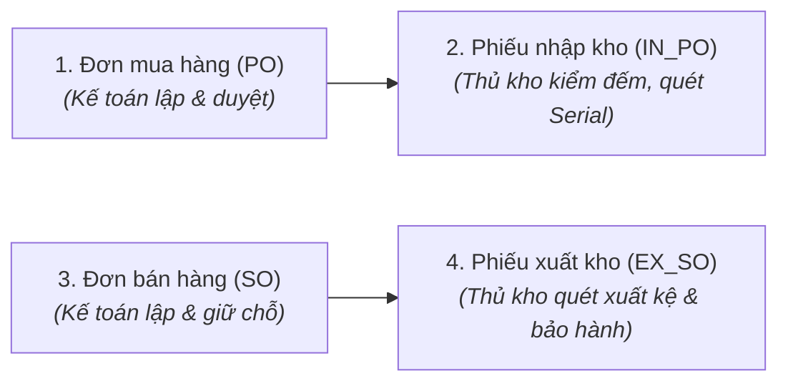

# QUY TẮC NGHIỆP VỤ (BUSINESS RULES) LUỒNG MUA - NHẬP - BÁN - XUẤT KHO
## HỆ THỐNG QUẢN LÝ KHO DUY LONG COMPUTER (DLC-WMS)

---

## MỤC LỤC
1. [Tổng quan & 4 Nguyên tắc Cốt lõi](#1-tổng-quan--4-nguyên-tắc-cốt-lõi)
2. [Phân hệ 1: Mua hàng (Purchase Order - PO)](#2-phân-hệ-1-mua-hàng-purchase-order---po)
3. [Phân hệ 2: Nhập kho (Import / Goods Receipt)](#3-phân-hệ-2-nhập-kho-import--goods-receipt)
4. [Phân hệ 3: Bán hàng (Sales Order & Bán lẻ POS)](#4-phân-hệ-3-bán-hàng-sales-order--bán-lẻ-pos)
5. [Phân hệ 4: Xuất kho (Export / Goods Issue)](#5-phân-hệ-4-xuất-kho-export--goods-issue)
6. [Phân hệ 5: Quy tắc Bỏ ghi sổ an toàn (Unpost & Reissue Safeguards)](#6-phân-hệ-5-quy-tắc-bỏ-ghi-sổ-an-toàn-unpost--reissue-safeguards)
7. [Ma trận Phân quyền Thao tác (RBAC Matrix)](#7-ma-trận-phân-quyền-thao-tác-rbac-matrix)
8. [Vòng đời & Sơ đồ Chuyển đổi Trạng thái Chứng từ](#8-vòng-đời--sơ-đồ-chuyển-đổi-trạng-thái-chứng-từ)
9. [Bảng Tra cứu Mã Lỗi Nghiệp vụ (System Error Codes)](#9-bảng-tra-cứu-mã-lỗi-nghiệp-vụ-system-error-codes)

---

## 1. TỔNG QUAN & 4 NGUYÊN TẮC CỐT LÕI

Hệ thống DLC-WMS vận hành luồng thương mại - kho bãi theo mô hình khép kín gồm 4 mắt xích chính:


### 4 Nguyên tắc vận hành bất biến:
1. **Tách bạch Tuyệt đối giữa Giá trị (Tài chính) và Hiện vật (Kho bãi):**
   - **Kế toán (`Accountant`):** Quản lý nhà cung cấp, khách hàng, hóa đơn chứng từ, giá mua/bán, thuế VAT và công nợ.
   - **Thủ kho (`Warehouse Controller`):** Quản lý số lượng thực tế, vị trí lưu trữ, quét mã vạch Serial/IMEI, hàng lỗi/hỏng. **Thủ kho bị khóa cứng và ẩn hoàn toàn các ô Đơn giá, Thành tiền, Thuế VAT.**
2. **Tuyệt đối không có Tồn kho âm (Zero Negative Inventory):**
   - Hệ thống chặn mọi hành động ghi sổ khiến tồn kho thực tế (`quantity_on_hand`) hoặc tồn kho khả dụng (`quantity_available`) nhỏ hơn 0.
3. **Quản lý theo Định danh Duy nhất (Serial/IMEI Tracking):**
   - Các linh kiện điện tử cốt lõi (CPU, VGA, Mainboard, Laptop, Màn hình...) bắt buộc phải quét Serial.
   - Số lượng Serial quét vào phải khớp chính xác 100% với số lượng thực tế trên phiếu. Không cho phép thừa hoặc thiếu.
4. **Bảo toàn Toàn vẹn Dữ liệu & Kiểm toán vết (Safeguards & Audit Trail):**
   - Mọi thao tác thêm/sửa/xóa/ghi sổ/hủy đều ghi nhận vào `AuditLog` (Append-only).
   - Chứng từ đã ghi sổ (`POSTED`) không được xóa trực tiếp. Muốn điều chỉnh phải qua quy trình **Bỏ ghi sổ an toàn (Unpost & Reissue)** với cơ chế kiểm tra phụ thuộc 6 chiều.

---

## 2. PHÂN HỆ 1: MUA HÀNG (PURCHASE ORDER - PO)

*Áp dụng trong `com.duylongtech.backend.feature.purchase_order`.*

| Mã BR | Tên Quy tắc | Nội dung chi tiết & Ràng buộc hệ thống |
| :--- | :--- | :--- |
| **PO-BR-01** | **Nhà cung cấp hợp lệ** | PO chỉ được tạo cho đối tác tồn tại trên hệ thống và có cờ `isSupplier = true`. Báo lỗi nếu thiếu thông tin nhà cung cấp (`PO_ERR_006`). |
| **PO-BR-02** | **Dòng hàng tối thiểu** | Mỗi PO bắt buộc phải có ít nhất một dòng sản phẩm (`lines.size() >= 1`). Số lượng đặt mua (`quantity`) và đơn giá (`unitPrice`) của từng dòng phải $> 0$. |
| **PO-BR-03** | **Hạn thanh toán** | Hạn thanh toán (`paymentDueDate`) nếu có thì không được nhỏ hơn ngày lập đơn (`poDate`) (`PO_ERR_003`). |
| **PO-BR-04** | **Tính toán tài chính tự động** | $$\text{Thành tiền dòng} = \text{Số lượng} \times \text{Đơn giá}$$<br/>$$\text{Thuế VAT dòng} = \text{Thành tiền dòng} \times \frac{\text{VAT Rate}(\%)}{100}$$<br/>$$\text{Tổng giá trị đơn} = \sum \text{Thành tiền dòng} + \sum \text{Thuế VAT dòng}$$ |
| **PO-BR-05** | **Quyền chỉnh sửa đơn** | Chỉ được phép chỉnh sửa thông tin nhà cung cấp, ngày hẹn giao, thêm/bớt dòng sản phẩm khi PO đang ở trạng thái **`DRAFT`**. Khi đã duyệt, PO bị khóa sửa (`PO_ERR_004`). |
| **PO-BR-06** | **Phê duyệt đơn mua (Approval)** | Chỉ `ROLE_MANAGER` hoặc `ROLE_ACCOUNTANT` mới có quyền duyệt PO (`DRAFT` $\rightarrow$ `APPROVED`). Đơn mua phải ở trạng thái `APPROVED` mới đủ điều kiện tạo phiếu nhập kho. |
| **PO-BR-07** | **Hủy đơn mua (Cancellation)** | Chỉ được phép hủy đơn khi PO đang ở trạng thái `DRAFT`. Hệ thống từ chối hủy đơn khi PO đã `APPROVED`, `POSTED` hoặc đã bị hủy trước đó. |
| **PO-BR-08** | **Đóng đơn hụt (Short Close)** | Khi nhà cung cấp không thể giao tiếp số lượng còn thiếu, Quản lý có thể thực hiện **Đóng đơn hụt (`Short Close`)** cho PO `APPROVED` để kết thúc vòng đời đơn mà không ép nhập bù. Có thể hoàn tác (`Revert Short Close`) nếu NCC tiếp tục giao. |
| **PO-BR-09** | **Kiểm soát phân bổ nhập hàng đa kho (`PurchaseOrderReceiving`)** | Hệ thống theo dõi tiến độ nhận hàng theo cặp `(variantId, warehouseId)`. Việc giao hàng tại kho A không bị trừ nhầm hạn mức của kho B. Tổng số lượng đưa vào các phiếu nhập (kể cả phiếu nháp) không được vượt quá số lượng đặt mua ban đầu. |
| **PO-BR-10** | **Tự động hoàn thành đơn mua** | Đơn mua tự động chuyển trạng thái sang **`POSTED`** ngay khi tất cả các dòng hàng đã được **Ghi sổ nhập kho đủ 100% số lượng đặt**. |

---

## 3. PHÂN HỆ 2: NHẬP KHO (IMPORT / GOODS RECEIPT)

*Áp dụng trong `com.duylongtech.backend.feature.inventory` (Import).*

| Mã BR | Tên Quy tắc | Nội dung chi tiết & Ràng buộc hệ thống |
| :--- | :--- | :--- |
| **IMP-BR-01** | **Nguồn gốc chứng từ nhập** | Phiếu nhập kho được tạo từ 5 nguồn: (1) Từ Đơn mua hàng PO đã duyệt, (2) Chuyển kho đến (`TRANSFER_IMPORT`), (3) Điều chỉnh thừa sau kiểm kê (`INVENTORY_ADJUSTMENT`), (4) Thu hồi sau tháo dỡ máy bộ (`ASSEMBLY`), (5) Khách trả hàng bảo hành/đổi mới (`RETURN`). |
| **IMP-BR-02** | **Chặn nhập vượt hạn mức PO** | Khi tạo phiếu nhập từ PO, số lượng nhập từng biến thể (`quantityIn`) không được vượt quá số lượng còn lại chưa nhập của PO (`INV_ERR_047`):<br/>$$\text{QtyIn} \le \text{OrderedQty} - \text{ReceivedAlready} - \text{DraftAllocated}$$ |
| **IMP-BR-03** | **Quét Serial bắt buộc & Khớp số lượng** | Đối với sản phẩm quản lý theo Serial (`trackSerial = true`), số lượng mã Serial quét vào phải **chính xác bằng số lượng thực nhận** (`stripTrailingZeros().intValueExact()`). Nếu lệch dù chỉ 1 serial, hệ thống từ chối ghi sổ (`INV_ERR_042`). |
| **IMP-BR-04** | **Chống trùng Serial hệ thống** | Từng Serial quét vào phải là duy nhất. Hệ thống tự động chặn nếu Serial đó đã tồn tại trên hệ thống ở trạng thái `AVAILABLE` (Trong kho) hoặc đang được lắp ráp trong case PC (`INV_ERR_049`). |
| **IMP-BR-05** | **Phân quyền & Bảo mật giá** | Thủ kho (`ROLE_WAREHOUSE_CONTROLLER`) chỉ thao tác trên trường `Thực nhận`, `Số lượng lỗi/hỏng`, `Quét Serial`. Mọi cột giá vốn, chiết khấu, VAT bị khóa và ẩn hoàn toàn khỏi giao diện của thủ kho. |
| **IMP-BR-06** | **Phát hiện & Cảnh báo chênh lệch (`Discrepancy`)** | Khi số lượng thực tế $<$ số lượng dự kiến (`actualQty < expectedQty`) hoặc có hàng lỗi trả về (`rejectedQty > 0`):<br/>• Hệ thống tự động gắn cờ `hasDiscrepancy = true` và ghi chú chi tiết vào `discrepancyNote`.<br/>• Gửi thông báo tức thời (`AppNotification`) đến Quản lý và Kế toán để đối soát công nợ. |
| **IMP-BR-07** | **Tạo phiếu nhập bù (Backorder Import Slip)** | Đối với các PO bị giao thiếu, hệ thống cung cấp API tạo nhanh phiếu nhập bù (`POST /imports/backorder/{poId}?warehouseId=...`) cho đúng phần số lượng còn thiếu. |
| **IMP-BR-08** | **Hạch toán Tồn kho & Giá vốn khi Ghi sổ (POST)** | Ngay khi bấm Ghi sổ (`POST`):<br/>1. Tồn kho thực tế (`quantity_on_hand`) tăng theo số lượng thực nhận.<br/>2. Ghi nhận lớp giá FIFO mới vào bảng `INVENTORY_COST_LAYERS`.<br/>3. Tính lại giá vốn trung bình (Moving Average Cost - MAC):<br/>$$\text{NewAvgCost} = \frac{(\text{Tồn cũ} \times \text{Giá cũ}) + (\text{Nhập mới} \times \text{Giá nhập})}{\text{Tồn cũ} + \text{Nhập mới}}$$<br/>4. Ghi Thẻ kho chi tiết (`INVENTORY_LEDGERS`) loại giao dịch `IN`. |
| **IMP-BR-09** | **Khởi tạo Serial vật lý** | Tất cả Serial hợp lệ trong phiếu nhập được lưu vào bảng `SERIAL_NUMBERS` với trạng thái `AVAILABLE`, gắn đúng `warehouse_id`, `import_doc_id` và giá nhập gốc. |
| **IMP-BR-10** | **Tự động kích hoạt chuyển giữ chỗ Bán hàng (`Auto-evaluate Backorders`)** | Ngay khi hàng nhập về kho, hệ thống tự động quét các đơn bán hàng đang bị thiếu hàng (`BACKORDERED`) theo thứ tự FIFO và chuyển trạng thái giữ chỗ sang `HOLDING` nếu tồn kho đã đủ đáp ứng. |
| **IMP-BR-11** | **Ghi nhận công nợ Nhà cung cấp** | Ghi sổ nhập kho tự động hạch toán tăng nợ phải trả Nhà cung cấp vào Sổ cái công nợ (`PartnerLedger` - mã `INVENTORY_IMPORT`):<br/>$$\text{Tổng nợ NCC} = \sum (\text{Số lượng thực nhận} \times \text{Đơn giá mua}) + \text{Thuế VAT}$$ |

---

## 4. PHÂN HỆ 3: BÁN HÀNG (SALES ORDER & BÁN LẺ POS)

*Áp dụng trong `com.duylongtech.backend.feature.sales_order`.*

| Mã BR | Tên Quy tắc | Nội dung chi tiết & Ràng buộc hệ thống |
| :--- | :--- | :--- |
| **SO-BR-01** | **Khách hàng hợp lệ** | Đơn bán hàng chỉ được tạo cho khách hàng có trạng thái `APPROVED` (`isCustomer = true`). Không tạo đơn bán cho khách hàng đang bị khóa (`INACTIVE`) (`CHK_ERR_004`). |
| **SO-BR-02** | **Hạn thanh toán đơn bán** | Hạn thanh toán (`paymentDueDate`) không được trước ngày lập đơn (`soDate`) (`SO_ERR_008`) và không được nằm trong quá khứ (`SO_ERR_007`). |
| **SO-BR-03** | **Cơ chế Duyệt đơn & Giữ chỗ kho (Stock Reservation)** | Khi duyệt SO (`DRAFT` $\rightarrow$ `APPROVED`):<br/>• Hệ thống tính tồn kho khả dụng: $\text{Available} = \text{On\_Hand} - \text{Reserved}$.<br/>• Nếu đủ hàng: Tạo bản ghi giữ chỗ trạng thái **`HOLDING`**, thời hạn giữ mặc định là **24 giờ** (cấu hình động qua `SystemSettings`). Tăng `quantity_reserved` trong kho.<br/>• **Cho phép Backorder:** Nếu không đủ hàng, hệ thống vẫn cho phép duyệt đơn, tạo bản ghi giữ chỗ trạng thái **`BACKORDERED`** để ghi nhận nhu cầu và chờ nhập hàng bù. |
| **SO-BR-04** | **Quyền chỉnh sửa đơn bán** | Chỉ được sửa thông tin khách hàng, địa chỉ giao hàng và danh sách sản phẩm khi SO đang ở trạng thái **`DRAFT`**. Khi đã duyệt (`APPROVED`), đơn bán bị khóa cứng dữ liệu (`SO_ERR_009`). |
| **SO-BR-05** | **Hủy đơn bán (Cancel) & Giải phóng tồn giữ chỗ** | • Không được phép hủy đơn bán nếu đã có ít nhất một phiếu xuất kho liên kết đã Ghi sổ (`POSTED`).<br/>• Khi hủy SO hợp lệ: Hệ thống tự động **giải phóng toàn bộ giữ chỗ** (cả `HOLDING` lẫn `BACKORDERED`), hoàn trả `quantity_reserved` về kho và đưa trạng thái reservation về `RELEASED`. |
| **SO-BR-06** | **Tự động hoàn thành đơn bán** | Đơn bán SO tự động chuyển sang trạng thái **`POSTED`** (Hoàn thành) khi **tất cả các dòng giữ chỗ thuộc SO đều đã được xuất kho đủ (`FULFILLED`)** qua các phiếu xuất. |
| **SO-BR-07** | **Bán hàng trực tiếp tại quầy (Direct Checkout / POS)** | Giao dịch bán lẻ tại quầy xử lý trọn gói trong 1 Transaction:<br/>1. Tạo SO trạng thái `APPROVED` (gán mã khách lẻ `KH-0000` nếu là khách vãng lai).<br/>2. Tạo phiếu xuất kho `EX_SO` liên kết.<br/>3. Tự động sinh và ghi sổ Phiếu thu tiền mặt/chuyển khoản (`PaymentReceipt` - `POSTED`).<br/>4. Cập nhật dòng tiền và công nợ tức thời. |

---

## 5. PHÂN HỆ 4: XUẤT KHO (EXPORT / GOODS ISSUE)

*Áp dụng trong `com.duylongtech.backend.feature.inventory` (Export).*

| Mã BR | Tên Quy tắc | Nội dung chi tiết & Ràng buộc hệ thống |
| :--- | :--- | :--- |
| **EXP-BR-01** | **Điều kiện tạo phiếu xuất từ SO** | Chỉ được tạo phiếu xuất kho cho đơn bán hàng đang ở trạng thái **`APPROVED`**. Đơn chưa duyệt (`DRAFT`) hoặc đã hủy (`CANCELLED`) bị từ chối tạo phiếu xuất. |
| **EXP-BR-02** | **Tách phiếu xuất theo kho (Multi-warehouse SO)** | Nếu đơn bán hàng có các linh kiện nằm ở nhiều kho khác nhau, chức năng tạo phiếu xuất tự động tách thành **các phiếu xuất độc lập tương ứng với từng kho vật lý**. |
| **EXP-BR-03** | **Chặn xuất vượt đơn đặt hàng** | Số lượng xuất của từng dòng không được vượt quá số lượng chưa xuất của đơn bán (`INV_ERR_048`):<br/>$$\text{QtyOut} \le \text{OrderedQty} - \text{ExportedAlready}$$ |
| **EXP-BR-04** | **Kiểm tra Tồn kho khả dụng khi lập phiếu** | Khi tạo hoặc sửa phiếu xuất, hệ thống kiểm tra tồn kho tại kho xuất:<br/>$$\text{TotalAvailable} = (\text{On\_Hand} - \text{Reserved}) + \text{Reserved\_For\_This\_SO}$$<br/>Nếu $\text{TotalAvailable} < \text{QtyOut}$, hệ thống chặn ngay lập tức và báo lỗi `INV_ERR_013` (không đợi đến lúc ghi sổ mới báo). |
| **EXP-BR-05** | **Ràng buộc tính hợp lệ của Serial xuất kho** | Từng Serial chỉ định xuất kho bắt buộc phải thỏa mãn 4 điều kiện:<br/>1. Trạng thái phải là `AVAILABLE` (Sẵn sàng xuất).<br/>2. Phải nằm tại **đúng Kho xuất** của phiếu (`warehouse_id` khớp).<br/>3. Phải thuộc **đúng Biến thể sản phẩm** (`variant_id` khớp).<br/>4. **Chưa bị gắn trong case PC khác:** Không nằm trong danh mục linh kiện đang cấu thành máy bộ hoạt động (`existsActiveComponentSerial`). |
| **EXP-BR-06** | **Trừ tồn kho & Tính giá vốn FIFO khi Ghi sổ (POST)** | Khi Thủ kho bấm Ghi sổ phiếu xuất (`POST`):<br/>1. Giảm tồn kho thực tế: $\text{On\_Hand} = \text{On\_Hand} - \text{QtyOut}$.<br/>2. Tiêu trừ số lượng từ các lớp giá cũ nhất đến mới nhất theo nguyên tắc **FIFO (`InventoryCostLayer`)** để xác định giá vốn hàng bán (COGS).<br/>3. Ghi Thẻ kho (`INVENTORY_LEDGERS`) loại `OUT` với giá vốn bình quân thực tế của lần xuất. |
| **EXP-BR-07** | **Cập nhật trạng thái Serial & Fulfill Giữ chỗ** | • Tất cả Serial đã xuất chuyển trạng thái sang **`SOLD`** (Đã bán), đồng thời lưu vết thời điểm bán `sold_at` và `sales_order_line_id`.<br/>• Giảm `quantity_reserved` trên bảng tồn kho và cập nhật trạng thái Reservation sang **`FULFILLED`**. |
| **EXP-BR-08** | **Tự động kích hoạt Bảo hành (Warranty Auto-generation)** | Nếu phiếu xuất có mục đích là `SALES` (Xuất bán hàng) và sản phẩm có thời hạn bảo hành (`warrantyMonths > 0`):<br/>• Tự động tạo Hồ sơ bảo hành (`WARRANTIES`) với mã `BHxxxxx`.<br/>• Ngày bắt đầu bảo hành (`startDate`): **Tính từ chính ngày ghi sổ phiếu xuất**.<br/>• Ngày hết hạn (`endDate`): $\text{startDate} + \text{warrantyMonths}$.<br/>• Trạng thái hồ sơ: `ACTIVE`. |
| **EXP-BR-09** | **Ghi nhận công nợ Khách hàng** | Ghi sổ xuất kho tự động hạch toán tăng nợ phải thu của Khách hàng vào Sổ cái công nợ (`PartnerLedger` - mã `INVENTORY_EXPORT_SO`):<br/>$$\text{Tổng nợ KH} = \sum (\text{Số lượng xuất} \times \text{Đơn giá bán}) + \text{Thuế VAT}$$ |
| **EXP-BR-10** | **Kiểm tra chênh lệch xuất kho** | Nếu số lượng thực xuất nhỏ hơn số lượng yêu cầu ban đầu, hệ thống đánh dấu `hasDiscrepancy = true`, lưu chi tiết lý do và gửi cảnh báo đến Quản lý/Kế toán. |

---

## 6. PHÂN HỆ 5: QUY TẮC BỎ GHI SỔ AN TOÀN (UNPOST & REISSUE SAFEGUARDS)

*Áp dụng trong `DocumentDependencyService.java` & `InventoryPostingService.java`.*

```
                 [YÊU CẦU BỎ GHI SỔ (UNPOST)]
                             │
            ┌────────────────┴────────────────┐
            ▼                                 ▼
   [PHIẾU NHẬP KHO]                  [PHIẾU XUẤT KHO]
   Kiểm tra 2 điều kiện:             Kiểm tra 3 điều kiện:
   1. Có gây âm tồn kho?             1. Đã xuất Hóa đơn điện tử?
   2. Serial đã bị xuất/bán?         2. Đã đăng ký Bảo hành?
                                     3. Đã tạo Phiếu sửa chữa?
            │                                 │
     ┌──────┴──────┐                   ┌──────┴──────┐
     ▼             ▼                   ▼             ▼
  [VI PHẠM]     [AN TOÀN]           [VI PHẠM]     [AN TOÀN]
  🚫 Chặn       ✅ Hoàn tác         🚫 Chặn       ✅ Hoàn tác
  yêu cầu xuất  tồn kho &           buộc dùng     tồn kho &
  trả NCC       sinh nháp           NHẬP TRẢ      sinh nháp
                mới                 (RETURN)      mới
```

| Mã BR | Loại phiếu | Điều kiện kiểm tra an toàn & Xử lý |
| :--- | :--- | :--- |
| **UNP-BR-01** | **Phiếu Nhập kho (Import)** | **CHẶN TUYỆT ĐỐI nếu:**<br/>1. **Gây âm kho:** Số lượng tồn thực tế hiện tại trong kho nhỏ hơn số lượng muốn hoàn tác nhập.<br/>2. **Serial đã xuất/sử dụng:** Bất kỳ Serial nào trong phiếu đã chuyển sang `SOLD`, `IN_USE` (đang lắp trong PC bộ) hoặc đã gắn vào bảo hành.<br/>$\rightarrow$ *Nếu an toàn:* Trừ lại tồn kho, xóa serial mới tạo, đảo ngược công nợ NCC (`reverseLedger`), chuyển PO liên quan về `APPROVED`, hủy phiếu cũ (`CANCELLED`) và sinh phiếu nháp mới (`DRAFT`) kèm mã tham chiếu `UNPOST_SOURCE` để người dùng sửa. |
| **UNP-BR-02** | **Phiếu Xuất kho (Export)** | **CHẶN TUYỆT ĐỐI nếu:**<br/>1. **Đã xuất Hóa đơn điện tử:** Phiếu xuất đã phát sinh Hóa đơn GTGT điện tử (`E-Invoice`) chưa bị hủy.<br/>2. **Đã phát sinh Bảo hành:** Serial xuất đi đã được kích hoạt phiếu bảo hành cho khách hàng.<br/>3. **Đã phát sinh Phiếu Sửa chữa:** Serial đã được tiếp nhận trong dịch vụ sửa chữa kỹ thuật.<br/>$\rightarrow$ *Khi bị chặn:* Hệ thống yêu cầu người dùng bắt buộc xử lý qua nghiệp vụ **Nhập trả hàng (`RETURN`)** thay vì bỏ ghi sổ.<br/>$\rightarrow$ *Nếu an toàn:* Hoàn trả tồn kho (+QtyOut), trả serial về `AVAILABLE`, đảo ngược công nợ khách hàng, chuyển SO về `APPROVED`, hủy phiếu cũ và tạo phiếu nháp mới. |

---

## 7. MA TRẬN PHÂN QUYỀN THAO TÁC (RBAC MATRIX)

> **Ký hiệu:**  
> • `FULL`: Toàn quyền thao tác.  
> • `CREATE`: Quyền lập phiếu nháp.  
> • `APPROVE`: Quyền phê duyệt đơn.  
> • `SCAN/POST`: Quyền kiểm đếm, quét mã và ghi sổ kho.  
> • `VIEW`: Chỉ xem dữ liệu.  
> • `DENIED`: Bị chặn truy cập.  

| Chức năng / Hành động | Super Admin | Manager | Thủ kho (Warehouse Controller) | Kế toán (Accountant) | Thủ quỹ (Cashier) |
| :--- | :---: | :---: | :---: | :---: | :---: |
| **Tạo Đơn mua hàng (PO)** | `FULL` | `FULL` | `DENIED` | `FULL` | `DENIED` |
| **Phê duyệt Đơn mua hàng (PO)** | `FULL` | `FULL` | `DENIED` | `DENIED` | `DENIED` |
| **Lập Đề nghị Nhập kho (Draft Import)** | `FULL` | `FULL` | `DENIED` | `FULL` | `DENIED` |
| **Quét Serial & Ghi sổ Nhập kho** | `FULL` | `FULL` | `SCAN/POST` | `DENIED` | `DENIED` |
| **Xem / Sửa Đơn giá nhập, Tiền mua** | `FULL` | `FULL` | 🔒 **BỊ ẨN / KHÓA** | `FULL` | `DENIED` |
| **Tạo Đơn bán hàng (SO)** | `FULL` | `FULL` | `VIEW` | `FULL` | `DENIED` |
| **Duyệt Đơn bán hàng (SO)** | `FULL` | `FULL` | `DENIED` | `FULL` | `DENIED` |
| **Lập Đề nghị Xuất kho từ SO** | `FULL` | `FULL` | `FULL` | `FULL` | `DENIED` |
| **Quét Serial kệ & Ghi sổ Xuất kho** | `FULL` | `FULL` | `SCAN/POST` | `DENIED` | `DENIED` |
| **Bỏ ghi sổ chứng từ kho (Unpost)** | `FULL` | `FULL` | `FULL` | `FULL` | `DENIED` |
| **Lập Phiếu thu tiền khách hàng** | `FULL` | `FULL` | `DENIED` | `VIEW` | `FULL` |
| **Lập Phiếu chi trả tiền NCC** | `FULL` | `FULL` | `DENIED` | `VIEW` | `FULL` |

---

## 8. VÒNG ĐỜI & SƠ ĐỒ CHUYỂN ĐỔI TRẠNG THÁI CHỨNG TỪ

### 8.1. Vòng đời Đơn mua hàng (PO Lifecycle)
```
[DRAFT] ──(Duyệt đơn)──> [APPROVED] ──(Ghi sổ đủ 100% phiếu nhập)──> [POSTED]
   │                          │
(Hủy đơn)               (Đóng đơn hụt)
   ▼                          ▼
[CANCELLED]             [SHORT_CLOSED]
```

### 8.2. Vòng đời Phiếu nhập kho (Import Slip Lifecycle)
```
[DRAFT] ──(Kế toán chuyển giao)──> [WAITING_RECEIPT] ──(Thủ kho bắt đầu đếm)──> [RECEIVING]
   │                                                                               │
   │                                                                         (Quét Serial & POST)
   │                                                                               ▼
[CANCELLED] <──────────────────(Bỏ ghi sổ / Unpost)─────────────────────── [POSTED]
```

### 8.3. Vòng đời Đơn bán hàng (SO Lifecycle)
```
[DRAFT] ──(Duyệt đơn & Giữ chỗ)──> [APPROVED] ──(Xuất đủ 100% hàng)──> [POSTED]
   │                                    │
(Hủy đơn)                        (Hủy đơn & Xả tồn)
   ▼                                    ▼
[CANCELLED]                        [CANCELLED]
```

### 8.4. Vòng đời Phiếu xuất kho (Export Slip Lifecycle)
```
[DRAFT] ──(Thủ kho chọn serial)──> [SUBMITTED] ──(Quét mã & Ghi sổ)──> [POSTED]
   │                                                                      │
   │                                                              (Bỏ ghi sổ an toàn)
   │                                                                      ▼
[CANCELLED] <────────────────────────────────────────────────────── [CANCELLED]
                                                                          │
                                                                   (Tạo phiếu mới)
                                                                          ▼
                                                                  [DRAFT (Reissued)]
```

---

## 9. BẢNG TRA CỨU MÃ LỖI NGHIỆP VỤ (SYSTEM ERROR CODES)

| Mã lỗi hệ thống | Nội dung thông báo lỗi hiển thị cho người dùng | Nguyên nhân kích hoạt quy tắc |
| :--- | :--- | :--- |
| `PO_ERR_003` | *Hạn thanh toán không được nhỏ hơn ngày lập đơn mua hàng.* | Nhập ngày `paymentDueDate < poDate`. |
| `PO_ERR_004` | *Chỉ có thể chỉnh sửa đơn mua hàng ở trạng thái DRAFT.* | Cố tình sửa PO đã `APPROVED` hoặc `POSTED`. |
| `PO_ERR_006` | *Đối tác được chọn không phải là Nhà cung cấp.* | Chọn nhầm đối tác có cờ `isSupplier = false`. |
| `SO_ERR_006` | *Chỉ có thể duyệt đơn bán hàng ở trạng thái DRAFT.* | Cố tình duyệt lại SO đã được duyệt trước đó. |
| `SO_ERR_007` | *Hạn thanh toán không được nằm trong quá khứ.* | Nhập ngày `paymentDueDate < LocalDate.now()`. |
| `SO_ERR_008` | *Hạn thanh toán không được nhỏ hơn ngày lập đơn bán.* | Nhập ngày `paymentDueDate < soDate`. |
| `INV_ERR_013` | *Số lượng xuất lớn hơn số lượng tồn kho khả dụng tại kho.* | Kho không đủ hàng khả dụng khi tạo/sửa phiếu xuất. |
| `INV_ERR_014` | *Chứng từ đã ghi sổ hoặc đã hủy, không thể chỉnh sửa.* | Sửa trực tiếp phiếu kho đã `POSTED` hoặc `CANCELLED`. |
| `INV_ERR_041` | *Sản phẩm %s không đủ tồn kho thực tế để xuất.* | Tồn kho thực tế `quantity_on_hand` $<$ số lượng xuất. |
| `INV_ERR_042` | *Sản phẩm %s quản lý theo serial, yêu cầu đúng %d serial.* | Số Serial quét vào không bằng số lượng xuất/nhập. |
| `INV_ERR_044` | *Serial %s không nằm trong kho xuất yêu cầu.* | Quét nhầm Serial đang thuộc về kho vật lý khác. |
| `INV_ERR_045` | *Serial %s đang ở trạng thái %s, không thể xuất.* | Quét Serial đã bán (`SOLD`) hoặc đang hỏng. |
| `INV_ERR_047` | *Số lượng nhập (%s) vượt quá số lượng còn lại của PO (%s).* | Nhập hàng vượt hạn mức đặt mua của PO. |
| `INV_ERR_048` | *Số lượng xuất (%s) vượt quá số lượng còn lại của SO (%s).* | Xuất kho vượt quá số lượng đặt bán của SO. |
| `INV_ERR_049` | *Số Serial đã tồn tại trong hệ thống.* | Quét trùng Serial đã có trong kho (`AVAILABLE`). |
