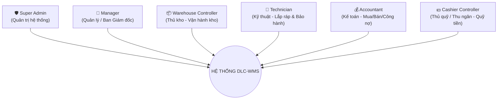
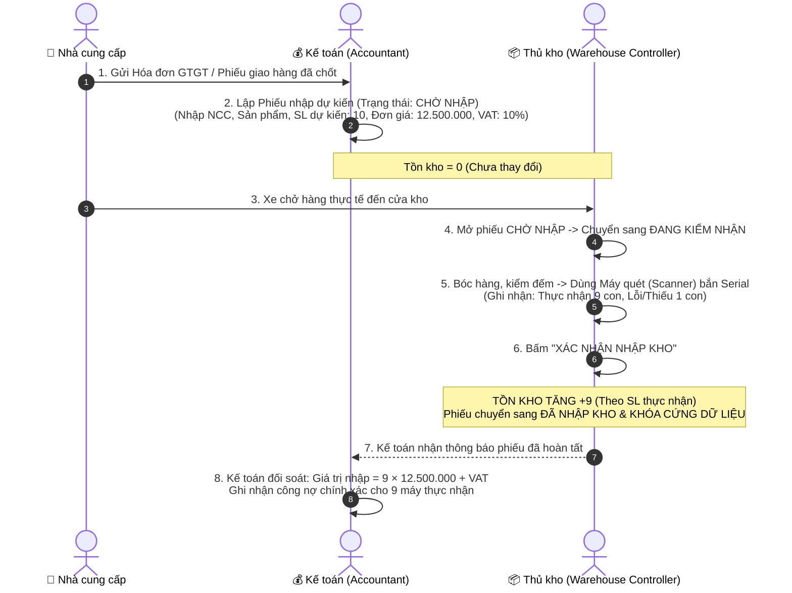
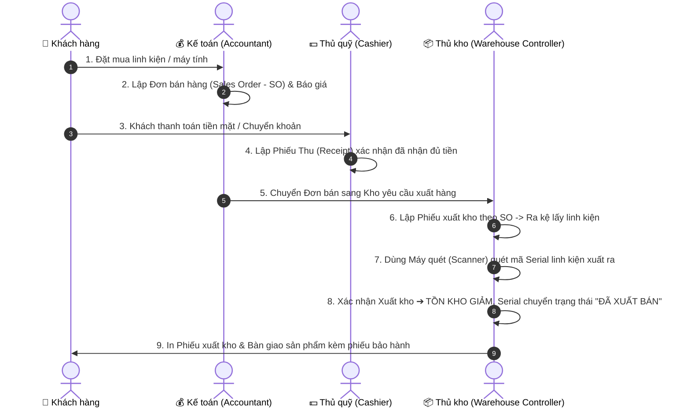

# TÀI LIỆU ĐẶC TẢ VAI TRÒ (ROLES) & QUY TRÌNH NGHIỆP VỤ VẬN HÀNH
## HỆ THỐNG QUẢN LÝ KHO DUY LONG COMPUTER (DLC-WMS)

---

## MỤC LỤC
1. [Tổng quan Hệ thống & Phạm vi Nghiệp vụ](#1-tổng-quan-hệ-thống--phạm-vi-nghiệp-vụ)
2. [Cơ cấu 6 Vai trò Người dùng (Human Roles)](#2-cơ-cấu-6-vai-trò-người-dùng-human-roles)
3. [Danh mục Thiết bị & Dịch vụ Tích hợp Ngoại vi](#3-danh-mục-thiết-bị--dịch-vụ-tích-hợp-ngoại-vi)
4. [Đặc tả Quy trình Nhập kho Chuẩn (Import Slip Workflow)](#4-đặc-tả-quy-trình-nhập-kho-chuẩn-import-slip-workflow)
5. [Đặc tả Quy trình Xuất kho & Bán hàng (Sales & Export Workflow)](#5-đặc-tả-quy-trình-xuất-kho--bán-hàng-sales--export-workflow)
6. [Đặc tả Quy trình Kỹ thuật - Lắp ráp PC & Dịch vụ Sau bán hàng](#6-đặc-tả-quy-trình-kỹ-thuật---lắp-ráp-pc--dịch-vụ-sau-bán-hàng)
7. [Đặc tả Quy trình Tài chính - Thu quỹ & Công nợ](#7-đặc-tả-quy-trình-tài-chính---thu-quỹ--công-nợ)
8. [Ma trận Phân quyền Chức năng (RBAC Matrix)](#8-ma-trận-phân-quyền-chức-năng-rbac-matrix)
9. [Danh sách Tài khoản Kiểm thử Mặc định (Seeded Accounts)](#9-danh-sách-tài-khoản-kiểm-thử-mặc-định-seeded-accounts)

---

## 1. TỔNG QUAN HỆ THỐNG & PHẠM VI NGHIỆP VỤ

**DLC-WMS** là hệ thống Quản lý Kho chuyên sâu kết hợp vận hành thương mại và dịch vụ kỹ thuật cho công ty phân phối linh kiện máy tính, lắp ráp PC và dịch vụ sửa chữa bảo hành **Duy Long Computer**.

### Phạm vi thiết kế (Design Scope):
* **Trọng tâm là Vận hành Kho & Quản lý Serial/IMEI:** Quản lý chính xác từng linh kiện máy tính theo mã định danh duy nhất (Serial/IMEI), vị trí lưu kho, trạng thái bảo hành và luân chuyển hàng hóa.
* **Không ôm đồm quy trình Mua sắm cồng kềnh (Procurement):** Quá trình tìm kiếm NCC, xin báo giá (RFQ), đàm phán chiết khấu diễn ra bên ngoài (qua email/Zalo/điện thoại). Hệ thống chỉ tiếp nhận dữ liệu khi đã có **chứng từ/hóa đơn đã chốt từ Nhà cung cấp**.
* **Phân định rõ ràng 2 lớp dữ liệu:** Tách bạch tuyệt đối giữa **"Dữ liệu giá trị/chứng từ kế toán"** (do Kế toán quản lý) và **"Dữ liệu hiện vật/tồn kho thực tế"** (do Thủ kho quản lý).

---

## 2. CƠ CẤU 6 VAI TRÒ NGƯỜI DÙNG (HUMAN ROLES)

Hệ thống được thiết kế theo chuẩn **RBAC (Role-Based Access Control)** với **6 vai trò chuyên biệt**, giải quyết triệt để tình trạng nhân viên (`STAFF`) ôm đồm mọi chức năng:



### Chi tiết nhiệm vụ từng vai trò:

| STT | Tên vai trò (Display Name) | Mã Code Hệ thống | Phân hệ & Trách nhiệm chính |
| :---: | :--- | :--- | :--- |
| **1** | **Super Admin** | `ROLE_SUPER_ADMIN` | • Quản lý tài khoản người dùng (tạo mới, khóa/mở khóa).<br/>• Cấu hình ma trận phân quyền chi tiết (Dynamic Permissions).<br/>• Xem nhật ký kiểm toán toàn hệ thống (Audit Log).<br/>• Trung tâm vận hành, sao lưu và khôi phục CSDL (Backup/Restore). |
| **2** | **Manager** | `ROLE_MANAGER` | • Quản lý điều hành chung hoạt động kinh doanh và kho vận.<br/>• Phê duyệt các đơn mua/bán, phiếu điều chỉnh kho vượt hạn mức.<br/>• Xem toàn bộ Dashboard báo cáo phân tích doanh số, tồn kho, lợi nhuận. |
| **3** | **Warehouse Controller** *(Thủ kho)* | `ROLE_WAREHOUSE_CONTROLLER` | • Tiếp nhận phiếu nhập `CHỜ NHẬP`, kiểm đếm, quét mã Serial thực tế và xác nhận `ĐÃ NHẬP KHO` (không thấy/sửa đơn giá).<br/>• Tạo và thực hiện Phiếu xuất kho, Phiếu chuyển kho, Phiếu kiểm kê.<br/>• Sử dụng thiết bị quét mã (Scanner) để kiểm soát hàng hóa. |
| **4** | **Technician** *(Kỹ thuật viên)* | `ROLE_TECHNICIAN` | • Tạo & quản lý Định mức linh kiện lắp ráp PC (BOM).<br/>• Thực hiện Lệnh lắp ráp máy bộ (Assembly Orders) và tháo dỡ máy.<br/>• Tiếp nhận, xử lý và cập nhật tiến độ hồ sơ Bảo hành & Phiếu sửa chữa máy. |
| **5** | **Accountant** *(Kế toán)* | `ROLE_ACCOUNTANT` | • Lập Phiếu nhập dự kiến dựa trên Hóa đơn NCC (nhập NCC, mã hàng, số lượng, đơn giá, VAT).<br/>• Lập Đơn bán hàng (SO), Báo giá và xuất Hóa đơn điện tử (E-Invoice).<br/>• Theo dõi, đối soát công nợ phải thu (Khách hàng) và phải trả (NCC). |
| **6** | **Cashier Controller** *(Thủ quỹ / Thu ngân)* | `ROLE_CASHIER_CONTROLLER` | • Quản lý tiền mặt tại quầy và tài khoản quỹ.<br/>• Lập & xác nhận Phiếu thu tiền (Receipt) khi khách mua hàng.<br/>• Lập & xác nhận Phiếu chi tiền (Payment Voucher) thanh toán cho NCC hoặc chi phí nội bộ.<br/>• Chốt sổ quỹ tiền mặt cuối ngày. |

---

## 3. DANH MỤC THIẾT BỊ & DỊCH VỤ TÍCH HỢP NGOẠI VI

Bên cạnh 6 vai trò con người, hệ thống tích hợp 4 thành phần ngoại vi & phần cứng:

1. 📱 **Scanner (Máy quét mã vạch / Mobile Scanner Client):**
   * **Bản chất:** Là thiết bị phần cứng (máy quét 2D/Honeywell/Zebra) hoặc điện thoại di động truy cập giao diện `/m/scan`.
   * **Người sử dụng:** Phục vụ trực tiếp cho `Warehouse Controller` (quét nhập/xuất/kiểm kê) và `Technician` (quét serial bảo hành/lắp ráp máy).
2. ☁️ **Cloudinary Media Storage:**
   * Lưu trữ ảnh linh kiện, ảnh chụp biên bản bàn giao, ảnh chụp tình trạng trầy xước/cháy nổ của linh kiện bảo hành, ảnh chứng từ hóa đơn và avatar.
3. 🤖 **AI Service (Google Gemini 2.5 Flash):**
   * Trợ lý AI Chatbot hỗ trợ tra cứu thông tin sản phẩm/tồn kho bằng ngôn ngữ tự nhiên.
   * Phân tích dữ liệu lịch sử xuất nhập để dự báo nhu cầu và cảnh báo mức tồn an toàn.
   * Hỗ trợ OCR nhận diện nhanh thông tin trên hóa đơn/phiếu giao hàng giấy.
4. 📬 **Google Services (Gmail & Google Drive):**
   * Gửi email tự động thông báo trạng thái đơn hàng, phiếu nhập/xuất cho đối tác & nhân sự.
   * Tự động sao lưu (Backup) file database hàng ngày và đẩy lên Google Drive an toàn.

---

## 4. ĐẶC TẢ QUY TRÌNH NHẬP KHO CHUẨN (IMPORT SLIP WORKFLOW)

### 4.1. Nguyên tắc cốt lõi: Tách bạch "Giá trị/Chứng từ" và "Hàng thực tế"
* **Kế toán** chỉ quản lý: Nhà cung cấp, Hóa đơn gốc, Danh mục hàng, Số lượng mua, Đơn giá mua, Thuế VAT.
* **Thủ kho** chỉ quản lý: Số lượng thực nhận, Quét nạp Serial/IMEI, Hàng lỗi/thiếu, Tình trạng ngoại quan.
* ⚠️ **Thủ kho BỊ KHÓA HOÀN TOÀN các ô: Đơn giá, VAT, Chiết khấu, Thành tiền.**

---

### 4.2. Sơ đồ luồng phối hợp Nhập kho



---

### 4.3. Vòng đời 4 trạng thái của Phiếu Nhập Kho

```
[DRAFT]  (Nháp - Kế toán đang tạo dở)
   │
   ▼
[WAITING_RECEIPT]  (Chờ nhập hàng - Kế toán đã chốt thông tin HĐ, chờ xe hàng đến)
   │
   ▼
[RECEIVING]  (Đang kiểm nhận - Thủ kho đang quét Serial và đếm số lượng)
   │
   ▼
[RECEIVED]  (Đã nhập kho - Thủ kho xác nhận ➔ Tồn kho tăng, Khóa phiếu)
```

| Trạng thái | Mã Code | Ai thao tác | Trạng thái Tồn kho | Quyền chỉnh sửa |
| :--- | :--- | :--- | :---: | :--- |
| **Nháp** | `DRAFT` | Kế toán | Không đổi (0) | Kế toán toàn quyền sửa. |
| **Chờ nhập** | `WAITING_RECEIPT` | Kế toán | Không đổi (0) | Kế toán có thể sửa nếu NCC đổi hóa đơn. |
| **Đang kiểm nhận** | `RECEIVING` | Thủ kho | Không đổi (0) | Thủ kho đang quét Serial, nhập số thực tế. |
| **Đã nhập kho** | `RECEIVED` | Thủ kho | 🟢 **+ SL THỰC NHẬN** | 🔒 **KHÓA DỮ LIỆU** (Không được sửa). |
| **Đã hủy** | `CANCELLED` | Kế toán / Manager | Không đổi (0) | Hủy phiếu khi NCC không giao hàng. |

---

### 4.4. Quy tắc tính Tồn kho và Tài chính
$$\text{Số lượng tăng tồn kho} = \text{Số lượng thực nhận (Actual Qty)}$$
$$\text{Giá trị hàng nhập kho} = \text{Số lượng thực nhận} \times \text{Đơn giá mua}$$
$$\text{Tổng tiền ghi nhận công nợ NCC} = (\text{Số lượng thực nhận} \times \text{Đơn giá mua}) + \text{Thuế VAT}$$

*Ví dụ:* NCC ghi hóa đơn 10 bộ máy Dell OptiPlex (Đơn giá 12.500.000đ). Khi giao tới chỉ có 9 bộ đạt chuẩn:
* **Tồn kho:** Tăng **+9 bộ** (và lưu 9 mã Serial `SN001` $\to$ `SN009`).
* **Công nợ ghi nhận trả NCC:** $9 \times 12.500.000 = 112.500.000\text{đ}$ (thay vì 125.000.000đ).

---

## 5. ĐẶC TẢ QUY TRÌNH XUẤT KHO & BÁN HÀNG (SALES & EXPORT WORKFLOW)



---

## 6. ĐẶC TẢ QUY TRÌNH KỸ THUẬT - LẮP RÁP PC & DỊCH VỤ SAU BÁN HÀNG

### 6.1. Quy trình Lắp ráp Máy bộ PC (PC Assembly / BOM)
1. **Thiết lập định mức (BOM - Bill of Materials):** Kỹ thuật viên (`Technician`) tạo cấu hình PC chuẩn (ví dụ: *PC Gaming i5-13400F / 16GB RAM / RTX 4060 / 500GB SSD*).
2. **Tạo Lệnh lắp ráp (Assembly Order):** Khi có đơn đặt hàng máy bộ, Kỹ thuật viên tạo lệnh lắp ráp $N$ bộ máy.
3. **Xuất linh kiện rời:** Thủ kho (`Warehouse Controller`) quét Serial xuất các linh kiện rời từ kho chuyển cho Kỹ thuật viên.
4. **Lắp ráp & Hoàn thiện:** Kỹ thuật viên ráp máy, test linh kiện, in tem Serial mới cho cả bộ case máy tính hoàn chỉnh.
5. **Nhập kho máy bộ:** Nhập case máy tính hoàn chỉnh vào kho thành phẩm để sẵn sàng xuất bán.

---

### 6.2. Quy trình Tiếp nhận Bảo hành & Sửa chữa (Warranty & Repair)
1. **Tiếp nhận máy lỗi:** Kỹ thuật viên (`Technician`) quét Serial/IMEI tra cứu hạn bảo hành trên hệ thống.
2. **Tạo Phiếu bảo hành/sửa chữa:** Ghi nhận lỗi của khách (không lên nguồn, lỗi RAM, màn hình xanh...), chụp ảnh ngoại quan upload lên Cloudinary.
3. **Xử lý kỹ thuật:**
   * Nếu bảo hành hãng: Đóng gói gửi hãng đổi trả.
   * Nếu sửa chữa dịch vụ: Báo giá linh kiện thay thế, công sửa chữa.
4. **Xuất linh kiện thay thế:** Kỹ thuật viên yêu cầu Thủ kho xuất linh kiện mới thay thế cho khách.
5. **Bàn giao máy:** Khách nhận máy, Thủ quỹ thu phí sửa chữa (nếu có), Kỹ thuật viên đóng phiếu hoàn tất.

---

## 7. ĐẶC TẢ QUY TRÌNH TÀI CHÍNH - THU QUỸ & CÔNG NỢ

* **Quản lý Thu tiền (Receipts):**
  * Do **Thủ quỹ (`Cashier Controller`)** lập khi khách hàng thanh toán tiền mặt/chuyển khoản cho Đơn bán hàng hoặc phí dịch vụ sửa chữa.
* **Quản lý Chi tiền (Payment Vouchers):**
  * Do **Thủ quỹ (`Cashier Controller`)** lập khi chi tiền thanh toán công nợ cho NCC (dựa trên giá trị phiếu nhập kho đã hoàn tất) hoặc chi tiền tạm ứng/chi phí hoạt động.
* **Đối soát Công nợ (Debt Tracking):**
  * Do **Kế toán (`Accountant`)** theo dõi bảng công nợ tổng hợp: Công nợ phải thu của Khách hàng và Công nợ phải trả Nhà cung cấp.

---

## 8. MA TRẬN PHÂN QUYỀN CHỨC NĂNG (RBAC MATRIX)

> **Ký hiệu:** 
> * `FULL`: Toàn quyền (Xem, Thêm, Sửa, Xóa, Xuất file, In).
> * `C/U/D`: Tạo, Sửa, Xóa.
> * `VIEW`: Chỉ xem số liệu.
> * `SCAN`: Quét nạp mã vạch/Serial.
> * `NONE`: Bị ẩn / Không có quyền truy cập.

| Phân hệ chức năng | Super Admin | Manager | Warehouse Controller | Technician | Accountant | Cashier Controller |
| :--- | :---: | :---: | :---: | :---: | :---: | :---: |
| **Quản lý Tài khoản & Phân quyền** | `FULL` | `NONE` | `NONE` | `NONE` | `NONE` | `NONE` |
| **Nhật ký Audit Log & Backup CSDL** | `FULL` | `VIEW` | `NONE` | `NONE` | `NONE` | `NONE` |
| **Phiếu Nhập kho (`/import-history`)** | `VIEW` | `FULL` | `RECEIVE/SCAN` | `NONE` | `CREATE/EDIT` | `NONE` |
| **Phiếu Xuất kho (`/export-slips`)** | `VIEW` | `FULL` | `FULL/SCAN` | `VIEW` | `VIEW` | `NONE` |
| **Chuyển kho & Kiểm kê** | `VIEW` | `FULL` | `FULL/SCAN` | `NONE` | `VIEW` | `NONE` |
| **Lắp ráp PC (BOM & Assembly)** | `VIEW` | `FULL` | `VIEW/EXPORT` | `FULL/SCAN` | `NONE` | `NONE` |
| **Bảo hành & Sửa chữa** | `VIEW` | `FULL` | `VIEW` | `FULL/SCAN` | `NONE` | `NONE` |
| **Đơn bán hàng (SO) & Báo giá** | `VIEW` | `FULL` | `VIEW` | `NONE` | `FULL` | `VIEW` |
| **Hóa đơn điện tử (E-Invoice)** | `VIEW` | `FULL` | `NONE` | `NONE` | `FULL` | `NONE` |
| **Thu chi & Sổ quỹ tiền mặt** | `VIEW` | `FULL` | `NONE` | `NONE` | `VIEW` | `FULL` |
| **Công nợ Khách hàng & NCC** | `VIEW` | `FULL` | `NONE` | `NONE` | `FULL` | `VIEW` |
| **Danh mục SP, Ngành hàng, ĐVT** | `FULL` | `FULL` | `VIEW` | `VIEW` | `VIEW` | `VIEW` |
| **Báo cáo Thống kê & Dashboard** | `ADMIN` | `FULL` | `KHO` | `DỊCH VỤ` | `TÀI CHÍNH` | `SỔ QUỸ` |
| **Mobile Scanner (`/m/scan`)** | `YES` | `YES` | `YES` | `YES` | `NO` | `NO` |
| **Trợ lý AI Chatbot** | `YES` | `YES` | `YES` | `YES` | `YES` | `YES` |

---

## 9. DANH SÁCH TÀI KHOẢN KIỂM THỬ MẶC ĐỊNH (SEEDED ACCOUNTS)

Tất cả các tài khoản mặc định được khởi tạo sẵn trong hệ thống với mật khẩu chung là: `123456`.

| STT | Tên đăng nhập (Username) | Mật khẩu | Họ và tên | Vai trò (Role) | Chức năng kiểm thử chính |
| :---: | :--- | :---: | :--- | :--- | :--- |
| **1** | `admin` | `123456` | System Administrator | `ROLE_SUPER_ADMIN` | Quản trị User, phân quyền ma trận, Backup CSDL. |
| **2** | `manager@duylong.vn` | `123456` | Quản Lý Điều Hành | `ROLE_MANAGER` | Xem full Dashboard, duyệt phiếu, quản lý toàn diện. |
| **3** | `wh_controller@duylong.vn`| `123456` | Trưởng Kho Vận | `ROLE_WAREHOUSE_CONTROLLER` | Kiểm nhận hàng, quét Serial nhập/xuất kho, kiểm kê. |
| **4** | `technician@duylong.vn` | `123456` | Kỹ Thuật Viên Trưởng | `ROLE_TECHNICIAN` | Lắp ráp case máy tính BOM, nhận bảo hành/sửa chữa. |
| **5** | `accountant@duylong.vn` | `123456` | Kế Toán Tổng Hợp | `ROLE_ACCOUNTANT` | Tạo phiếu nhập dự kiến, tạo đơn bán SO, công nợ. |
| **6** | `cashier@duylong.vn` | `123456` | Thủ Quỹ Thu Ngân | `ROLE_CASHIER_CONTROLLER` | Lập phiếu thu, phiếu chi, quản lý sổ quỹ tiền mặt. |

---
*Tài liệu được lưu trữ tại: [SYSTEM_ROLES_AND_WORKFLOW_SPEC.md](file:///d:/SEP490_G94/DLC-WMS/docs/SYSTEM_ROLES_AND_WORKFLOW_SPEC.md)*
